# Boo Notes — des notes liées à tout ce que vous étudiez

Prise de notes **au clavier**, quel que soit le support : chaque note reste **liée à son origine**
— l’instant d’une vidéo, d’un audio ou d’un flux en direct, la page d’un PDF, le passage d’un
article ou d’une page Notion, le paragraphe d’un texte, le repère posé sur un graphe — et y ramène
d’un clic, dans les deux sens. Organisées en **cours › chapitres › notes**, reliées entre elles par
`[[liens]]` et à **plusieurs supports** à la fois, elles forment un **second cerveau** que la
**carte mentale** dessine, que les **révisions** entretiennent, que l’**export** transforme en
fiches, cartes Anki et données pour QCM, et que **Notion** garde dans un tableau de votre page.

- **Extension navigateur** (Chrome, Edge, Brave…) : **toute vidéo ou tout audio du web** — YouTube,
  Udemy, Coursera, Notion, lecteurs intégrés (Vimeo, Kaltura, Panopto, Wistia…), lecteurs en web
  components, podcasts et radios `new Audio()`, et un **chronomètre** pour ce qu’aucun script ne
  peut lire — plus **toute page à lire** en **mode lecture** (citations liées au passage, surlignées
  dans la page). Chaque note se range dans un cours › chapitre depuis le panneau.
- **Transcription** ([docs/TRANSCRIPTION.md](docs/TRANSCRIPTION.md)) : pendant la lecture, les
  **sous-titres horodatés** sont recopiés en arrière-plan dans une transcription à part (onglet
  **Transcription**), **traduits** sur l’appareil ou à la main (anglais → français, français →
  anglais… au choix), **commentés**, une réplique s’**épingle** dans la note d’un geste ; les
  **passages** (`Alt+I` → `Alt+O`, ex. 02:05 → 06:07) gardent leur image, leur son, leurs
  sous-titres et les notes prises pendant eux (l’icône de leur carte ouvre leur transcription) ;
  le **son du cours** peut être conservé. La transcription est épinglée à la note à la fin.
  Sous-titres lus dans le lecteur, dans les fichiers qu’il télécharge (YouTube compris), dans les
  lecteurs intégrés ou à l’écran ; option **Activer sur tous les sites** pour que toute vidéo soit
  détectée sans clic.
- **Copier la note « tout compris »** : captures, images et cartes des passages **intégrées**,
  horodatages liés à l’instant, transcription — à coller dans **Obsidian**, **Notion**, Google Docs,
  Word… (Markdown et HTML à la fois) ; **Télécharger** ajoute les extraits vidéo et la transcription.
- **Copier / coller riche** dans les notes ([détails](docs/TRANSCRIPTION.md#copier--coller-dans-les-notes-extension-et-application)) :
  coller (ou glisser) une **capture d’écran**, une **image** du web, une **vidéo** ou un **audio**, du
  **texte mis en forme** (Notion, Docs, Word, pages web) avec ses images, ou une partie d’une autre
  note avec ses captures et extraits ; copier une partie d’une note emporte ses **images** ; **Copier
  l’image** d’une carte.
- **Application Desktop Windows** ([docs/DESKTOP.md](docs/DESKTOP.md)) : cours, chapitres et notes ;
  une note liée à plusieurs supports (**PDF**, **vidéo / audio** locaux ou **flux** par adresse —
  HLS, radios —, **images**, **textes**, pages vues dans le navigateur) ; **carte mentale** de tout
  le savoir (réseau groupé par cours, repliable, ou arborescence) ; **révisions** de cartes ;
  **export** (fiches PDF, Anki, Markdown, JSON). Interface **React + React Aria**, design **Liquid
  Glass**, typographie **SF Pro** (Apple) / **Inter** (Windows).
- **Notion** ([docs/NOTION.md](docs/NOTION.md)) : le tableau « Boo Notes — Mes notes » intégré à la
  page de votre choix, une page par note avec ses colonnes **Cours**, **Chapitre**, **Supports**, les
  `[[liens]]` en mentions et en relations — écrit par l’application, ou par l’extension quand
  l’application est fermée.

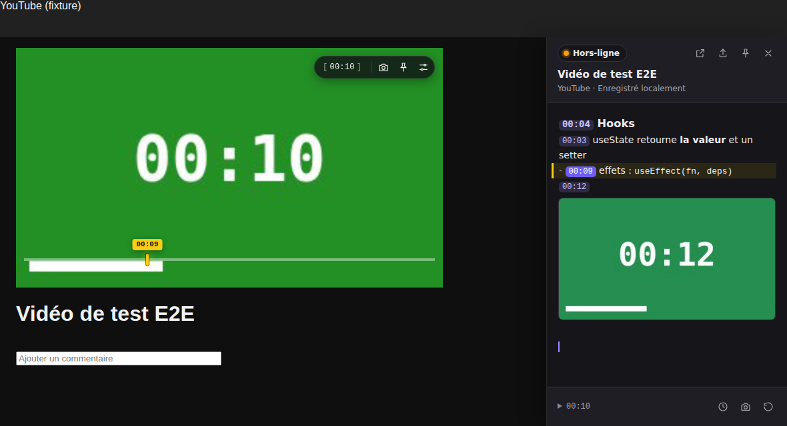

**Mode lecture** — un article : le passage cité est surligné dans la page et relié à sa note ;
la bulle « Citer » suit la sélection ; `[[Résistance électrique]]` relie une fiche.

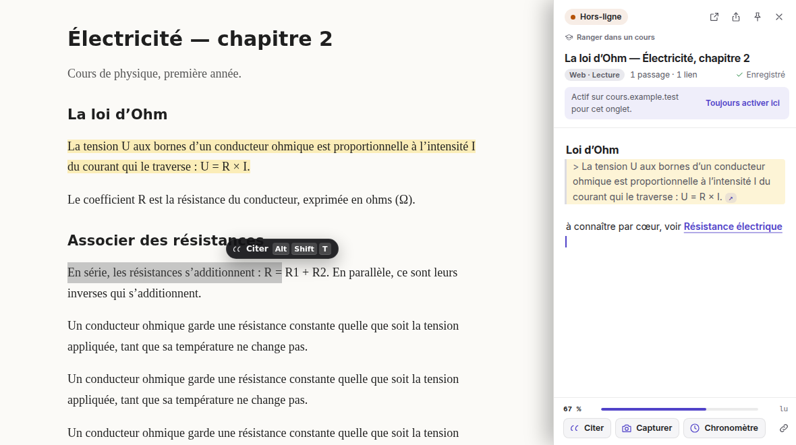

| Note vide : le mode d’emploi | Raccourcis (`Ctrl/⌘ + /`) | Toast de capture |
| --- | --- | --- |
| 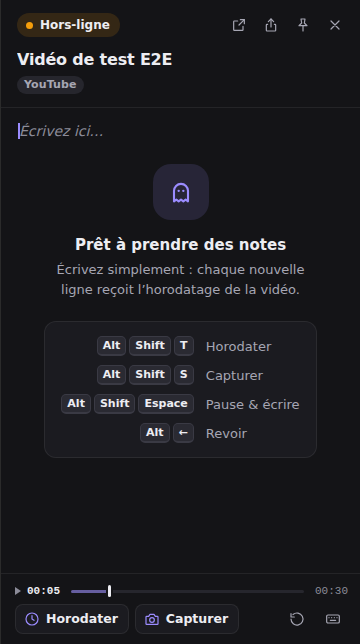 | 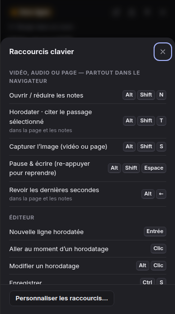 | 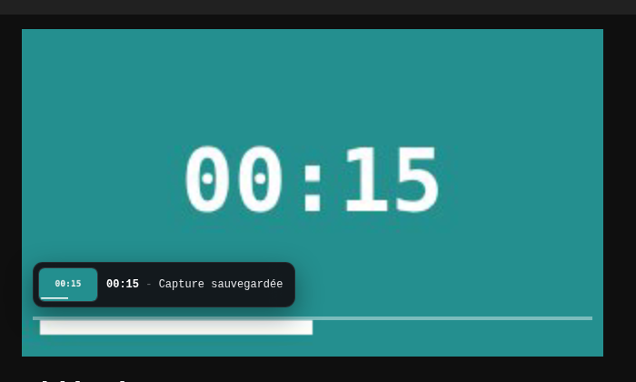 |

| Réglages | HUD et panneau flottant |
| --- | --- |
| 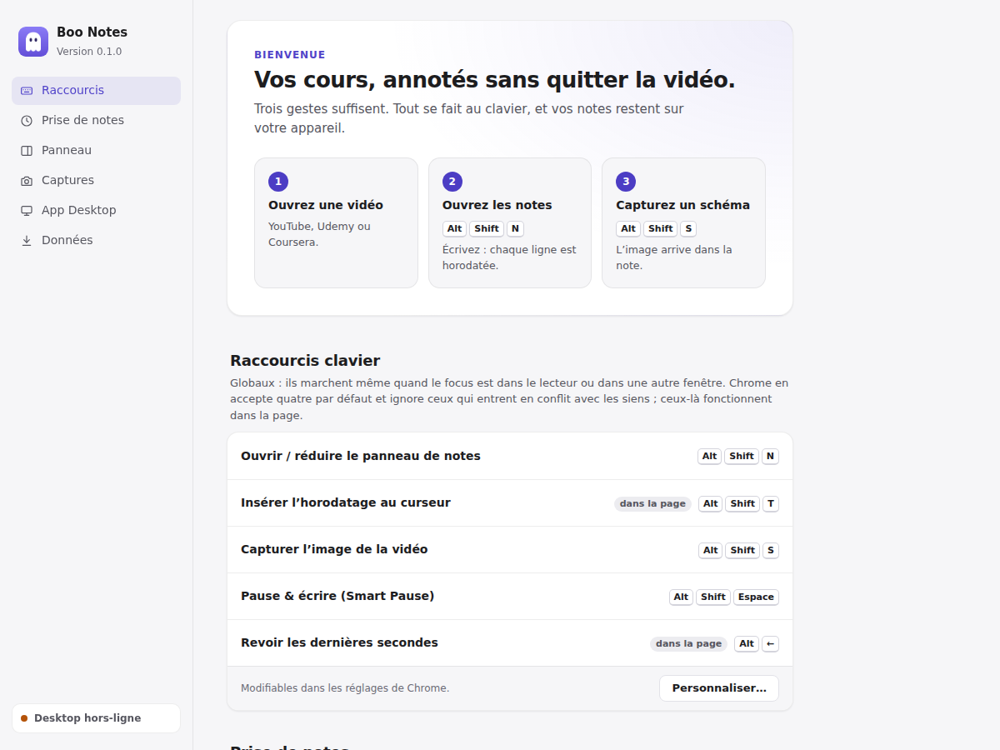 | 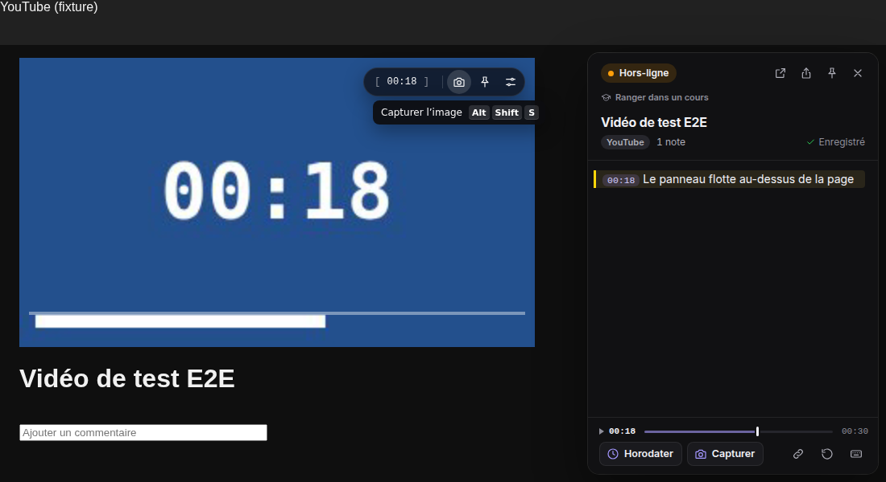 |

| Desktop : accueil | Desktop : une note, deux supports |
| --- | --- |
| 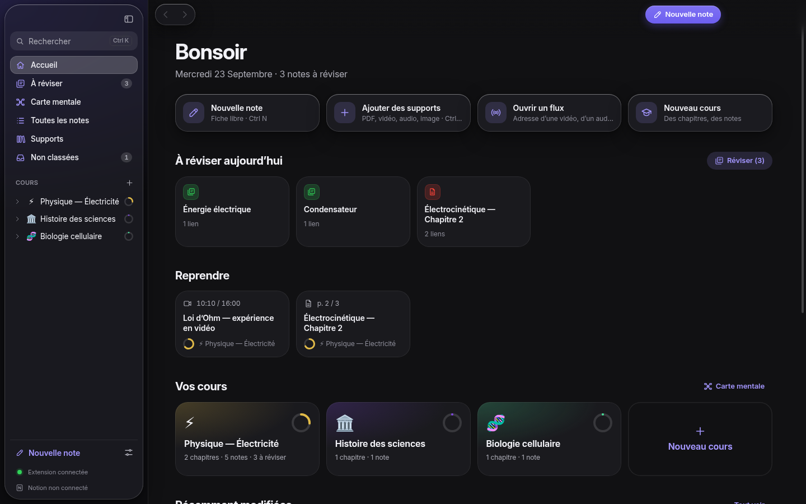 | 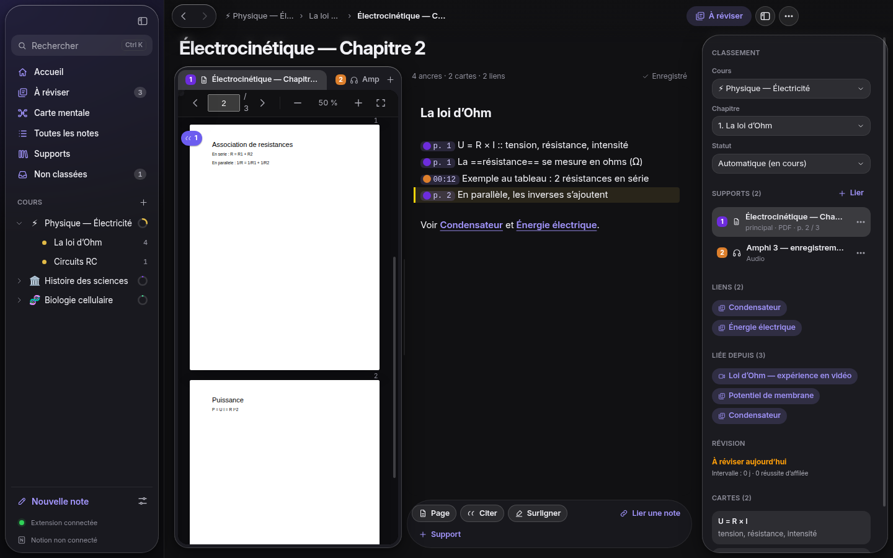 |

| Desktop : carte mentale (réseau groupé par cours) | Desktop : cours › chapitres › notes |
| --- | --- |
| 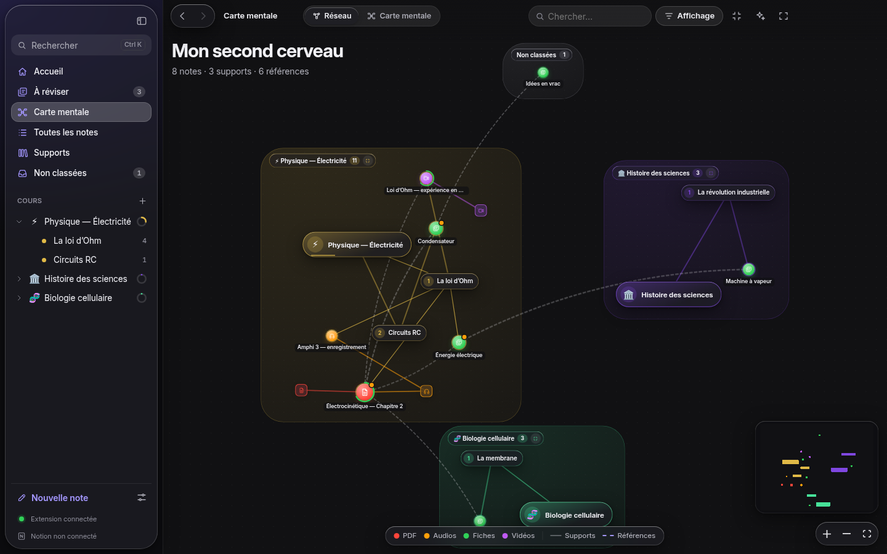 | 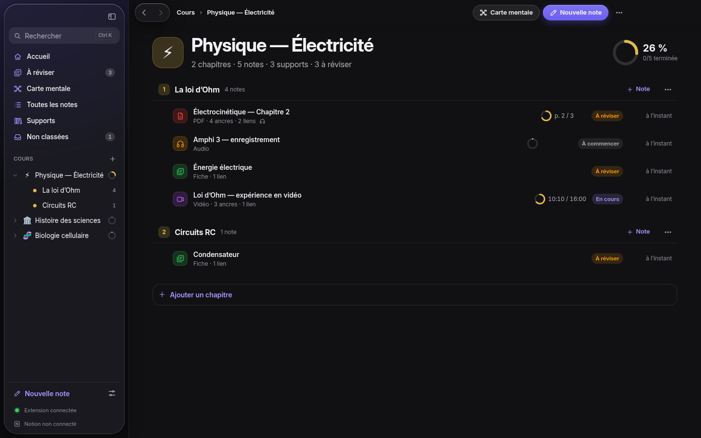 |

Extension Chrome / Chromium **Manifest V3** (TypeScript, DOM natif : légère, sans framework, pour ne
jamais alourdir les pages visitées) et application **Electron** (TypeScript, **React 19**, **React
Aria Components**, **Motion**, **Zustand**, **React Flow** + **d3**). L’éditeur, partagé par les
deux, s’appuie sur **CodeMirror 6** (Markdown « à la volée ») ; les PDF sont affichés avec
**pdf.js**, les flux HLS lus avec **hls.js**.

---

## Installation (développement)

```bash
npm ci
npm run build        # → dist/
```

1. Ouvrir `chrome://extensions`, activer le **mode développeur**.
2. **Charger l’extension non empaquetée** → sélectionner le dossier `dist/`.
3. Ouvrir une vidéo YouTube, une leçon Udemy ou Coursera, une page Notion, puis `Alt+Shift+N`. Sur
   tout autre site (podcast, article…), cliquer l’icône Boo Notes ou `Alt+Shift+N` active
   l’extension pour l’onglet ; « Toujours activer ici » la garde pour le site. Une page sans vidéo
   ni audio s’ouvre en **mode lecture**.

`npm run watch` reconstruit à chaque modification (recharger l’extension ensuite).

## Raccourcis

| Action | Défaut | Comportement |
| --- | --- | --- |
| Ouvrir / réduire le panneau | `Alt+Shift+N` | Ouvre le panneau et donne le focus à l’éditeur ; `Échap` le referme. |
| Insérer l’horodatage | `Alt+Shift+T` | Injecte `[MM:SS]` au curseur, sans interrompre la lecture. **Mode lecture** : cite le passage sélectionné (`> texte [↗](URL#:~:text=…)`), ou, sans sélection, ancre la ligne à la section lue (`[↗ Titre](…)`). |
| Capture d’écran | `Alt+Shift+S` | Capture la frame, flash 100 ms, toast, vignette `` dans la note. **Mode lecture** : capture la partie visible de la page. |
| Smart Pause | `Alt+Shift+Space` | Pause + focus sur une nouvelle ligne de l’éditeur ; un second appui relance la vidéo et rend le clavier au lecteur. |
| Saut arrière | `Alt+←` | Recule de 5 s (3 / 5 / 10 / 15 s au choix). |
| Début / fin du passage | `Alt+I` / `Alt+O` | Découpe un passage (02:05–06:07) : carte dans la note, extrait image + son, sous-titres et notes de l’intervalle. |
| Épingler la réplique en cours | `Ctrl+Shift+K` (`⌘⇧K`) | Dans le panneau : cite le sous-titre en cours (et sa traduction) dans la note. |
| Notes ⇄ Transcription | `Alt+T` | Dans le panneau et l’application. |
| Aide | `Ctrl+/` (`⌘/`) | Dans le panneau : feuille de tous les raccourcis (et `?` hors de l’éditeur). |

Les raccourcis globaux sont modifiables dans `chrome://extensions/shortcuts` (bouton dans les réglages).

> **Limites de Chrome, gérées automatiquement.** Chrome n’accepte que **4** raccourcis par défaut
> par extension et **ignore silencieusement** ceux qui entrent en conflit avec les siens —
> c’est le cas de `Alt+Shift+T` (« focus sur la barre d’outils » sous Windows / Linux). Tout
> raccourci par défaut non enregistré par Chrome est donc géré **dans la page et dans le panneau**
> (option « Raccourcis de secours dans la page », activée par défaut). Il fonctionne alors quand le
> focus est sur la vidéo ou dans les notes, mais pas depuis un autre onglet. La page d’options
> indique pour chaque action si le raccourci est global ou « dans la page ».

## Fonctionnalités (correspondance avec le cahier des charges)

| Cahier des charges | Implémentation |
| --- | --- |
| **Invisibilité** | Rien d’autre qu’un calque transparent n’est injecté tant que les notes ne sont pas ouvertes ; le HUD n’apparaît qu’au survol de la vidéo et disparaît après 2,5 s. |
| **Zéro friction** | Les 5 actions au clavier ; les raccourcis globaux fonctionnent aussi depuis le panneau, la fenêtre détachée ou un autre onglet (routés vers le lecteur actif). |
| **Non-intrusivité** | Le lecteur n’est jamais modifié : HUD, toasts, flash et marqueur sont dessinés dans un calque séparé (Shadow DOM) positionné d’après la géométrie de la vidéo. En mode « côte à côte », la page est décalée de la largeur du panneau et le panneau commence sous l’en-tête fixe de YouTube. |
| **Flow 1** | `Alt+Shift+N` → panneau + focus ; la première lettre tapée sur une ligne vide ajoute `[MM:SS]` (après `- `, `1. `, `## `, `> ` si présents) ; `Échap` ferme ou panneau laissé ouvert. |
| **Flow 2** | `Alt+Shift+S` → extraction `<canvas>` en résolution native, flash blanc 100 ms, toast `04:15 - Capture sauvegardée`, ligne `[04:15] ` rendue en vignette. |
| **Drawer** | À droite, 300–500 px (360 par défaut, poignée de redimensionnement), badge de synchronisation (vert / orange), titre de la vidéo ou du cours, pop-out, export (Desktop, Notion — via l’app ou directement —, `.md` + captures, presse-papier). |
| **Éditeur** | CodeMirror 6 : Markdown rendu sur les lignes inactives (titres, gras, code, citations), horodatages cliquables, vignettes, listes continuées. |
| **HUD** | `[ 04:15 ]` copie `[04:15](URL#t=255)` ; 📸 capture ; 📌 épingle le panneau ; ⚙️ paramètres. |
| **Auto-pause (option)** | Pause après 1,5 s de frappe continue, reprise 1 s après la dernière touche — uniquement si c’est l’extension qui a mis en pause. |
| **Surbrillance bidirectionnelle** | Survol d’un horodatage → marqueur sur la barre de progression native ; pendant la lecture, la ligne du dernier horodatage atteint est surlignée dans la note. |
| **Toasts** | Bas-gauche du lecteur (au-dessus des contrôles), 2 s, sombre, mono-espace. |
| **Capture** | `<canvas>` détaché à la résolution de la vidéo ; repli sur une capture de l’onglet recadrée si la source est cross-origin sans CORS. |
| **Desktop** | WebSocket local `ws://localhost:43117` + jeton d’appairage ; stockage `chrome.storage.local` d’abord, file d’envoi rejouée à la reconnexion. Voir [docs/PROTOCOL.md](docs/PROTOCOL.md). |
| **Multi-onglets** | Un seul lecteur actif : celui qui a reçu la dernière interaction ; les raccourcis lancés ailleurs lui sont routés (un média seulement : une page en mode lecture n’est pas pilotée depuis un autre onglet). |

### Formats et sources : chaque note ramène à son origine

| Support | Ancre d’une note | Extension | Application Desktop |
| --- | --- | --- | --- |
| **Vidéo** | `[04:15]` → l’instant | YouTube, Udemy, Coursera, vidéos déposées dans Notion, tout site activé, **lecteurs intégrés** en iframe, lecteurs en **shadow DOM** ; captures | MP4, WebM, MKV, MOV… locaux ou **par adresse** (HLS `.m3u8`) ; captures ; notes du navigateur, « Reprendre à 21:00 » |
| **Audio** | `[04:15]` | Podcasts, radios, audios Notion, tout `<audio>`, lecteurs `new Audio()` hors page (auto-pause, saut arrière) | MP3, M4A, WAV, OGG, Opus, FLAC… locaux ou par adresse (radios, podcasts) |
| **Flux illisible** (DRM, application, cours en salle) | `[04:15]` → l’instant du **chronomètre** | Chronomètre lancé depuis le panneau | — |
| **Page web / page Notion** | `> citation [↗](URL#:~:text=…)`, `[↗ Section](…)` → le passage, surligné | **Mode lecture** : citations, repères de section, passages surlignés dans la page, capture de la page, % lu | Notes reçues, « Rouvrir la page » |
| **PDF** | `[p. 12]` → la page | — | Notes par page, surlignage 4 couleurs, citations, pastilles de notes dans la marge |
| **Texte** (.txt, .md) | `[§ 4]` → le paragraphe | — | Paragraphes numérotés, citations |
| **Image** (graphe, schéma, tableau blanc) | `[pin 3]` → le repère | — | Repères numérotés posés sur l’image, zoom / déplacement |
| **Fiche de révision** | `[[Titre]]` → une autre note | Liens `[[…]]` (complétion des titres, clic = ouvrir la note) | Fiches reliées, aperçu au survol, « Liée depuis », révision espacée |
| **Plusieurs supports dans une note** | `[04:15](res:…)`, `[p. 12](res:…)` → le bon support | — | Onglets numérotés, pastilles sur les repères, support principal modifiable |
| **Cours › chapitre** | — | Classement depuis le panneau (cours de l’app proposés) | Arbre des cours, glisser-déposer, inspecteur, carte mentale |
| **Notion** | — | Envoi direct quand l’app est fermée (options › Notion) | Tableau « Boo Notes — Mes notes » dans votre page, synchro automatique |

### Au-delà du cahier des charges (UX)

| | |
| --- | --- |
| **Chronologie des notes** | Dans le pied du panneau : progression de la vidéo, un trait par note, un point par capture. Survol = aperçu sur la barre du lecteur, clic ou flèches = navigation. |
| **Mise en page « transcription »** | Le texte d’une ligne horodatée s’aligne après l’horodatage ; les crochets n’apparaissent que si le curseur touche l’horodatage. |
| **Cartes de capture** | Vignette 16:9 avec badge de temps et « ▶ Revoir » au survol. |
| **Transcription en arrière-plan** | Onglet qui suit la lecture comme un karaoké, bandeau du sous-titre en cours sous les notes, traduction sur l’appareil, commentaires, passages choisis dans la transcription, intervalles `[02:05–06:07]` qui rejouent le passage et s’arrêtent à sa fin. |
| **État vide pédagogique** | Une note vide explique quoi faire et montre les 4 raccourcis en touches. |
| **Retour au bon endroit** | « ✓ Copié » sur la pilule du HUD, vignette dans le toast de capture, snackbar pour les exports, « ✓ Enregistré » dans l’en-tête. |
| **Infobulles rapides** | Sur le HUD, avec les touches (`⌥ ⇧ S` sur macOS). |
| **Disposition superposée** | Carte flottante arrondie au-dessus de la page (et en plein écran). Double-clic sur le bord : largeur par défaut. |
| **Réglages** | Façon « Réglages système » : navigation latérale, interrupteurs, contrôles segmentés, choix visuel de la disposition, écran de bienvenue en 3 étapes. |

Détails : [docs/ARCHITECTURE.md](docs/ARCHITECTURE.md) · design & contrastes : [docs/DESIGN.md](docs/DESIGN.md).

### Liens horodatés

Les liens copiés ou exportés ont la forme demandée `URL#t=255`. Le script de contenu les interprète à
l’ouverture sur les trois plateformes (Udemy et Coursera ne gèrent pas ce fragment nativement).

## Application Desktop et Notion

L’extension fonctionne entièrement hors-ligne. Quand **Boo Notes Desktop** tourne (zone de
notification), les notes, captures et positions de lecture lui sont envoyées sur
`ws://localhost:43117` (badge vert) : elles rejoignent la bibliothèque, le dossier de notes
Markdown et, si Notion est connecté, le tableau Notion. Application fermée, l’extension écrit
elle-même dans Notion (connexion partagée par l’application ou saisie dans ses options).

- Installation, utilisation, build de l’installeur Windows : [docs/DESKTOP.md](docs/DESKTOP.md)
- Connexion à Notion en 3 étapes : [docs/NOTION.md](docs/NOTION.md)
- Protocole extension ↔ application : [docs/PROTOCOL.md](docs/PROTOCOL.md)

Pour développer l’extension sans l’application, un **mock** implémente le protocole et écrit les
notes en Markdown :

```bash
npm run mock:desktop -- --token mon-jeton     # écrit dans ./.boo-desktop-data/
```

## Développement

| Commande | Rôle |
| --- | --- |
| `npm run build` / `npm run watch` | Bundle esbuild → `dist/` |
| `npm run typecheck` | TypeScript strict |
| `npm test` | Tests unitaires (Vitest) : horodatage, plateformes, Markdown et repères qualifiés, cartes de révision, auto-stamp, auto-pause, raccourcis, stockage (dont le classement), synchronisation Desktop, passages d’une page, synchronisation Notion directe (API simulée), **contrastes WCAG des tokens** |
| `npm run test:e2e` | Tests de bout en bout (Playwright + Chromium avec l’extension chargée) sur une page « YouTube » locale |
| `npm run screenshots` | Régénère `docs/screenshots/` |
| `npm run fixtures` | Régénère la vidéo de test `tests/e2e/fixtures/sample.webm` |
| `cd desktop && npm start` | Application Desktop (voir [docs/DESKTOP.md](docs/DESKTOP.md) pour ses tests et l’installeur Windows) |

Les tests E2E couvrent : ouverture du panneau et horodatage automatique, `Alt+Shift+T` (y compris le
repli dans la page), Smart Pause (et sa bascule), capture + toast + vignette, `Alt+←`, HUD et copie du
lien, épinglage, plein écran, liens `#t=`, marqueur de prévisualisation et clic sur un horodatage,
chronologie (clic, aimantation, clavier), état vide et statistiques, feuille des raccourcis,
disposition flottante, largeur par défaut au double-clic, pop-out puis rattachement, export `.md` +
captures et copie du Markdown, persistance après rechargement, double injection du script de contenu,
synchronisation hors-ligne → en ligne avec le mock Desktop, jeton refusé, auto-pause, routage
multi-onglets, **podcast audio sur un site quelconque** (activation au raccourci, horodatage,
progression, capture refusée), « Toujours activer ici » et page d’options, **vidéo déposée dans une
page Notion** (note et capture liées à la page), **mode lecture** (citation liée au passage,
surlignage dans la page, retour au passage, bulle « Citer », repère de section, progression de
lecture), **`[[liens]]`** (complétion sans accents, ouverture de la note liée), **envoi direct
vers Notion** sans l’application (connexion dans les options, API Notion simulée), **tout flux**
(vidéo dans un shadow DOM fermé, `new Audio()` hors page, lecteur dans une iframe d’un autre
domaine : horodatage, saut, capture ; lecteur non autorisé proposé à l’autorisation ; chronomètre)
et le **classement cours › chapitre** depuis le panneau.

Côté Desktop : tests unitaires (bibliothèque v2 et migration, graphe et carte mentale, serveur
WebSocket avec le vrai client de l’extension, conversion Markdown → Notion, synchronisation
incrémentale contre une API Notion simulée) et tests d’interface Playwright + Electron (cours et
chapitres, note multi-supports, flux par adresse, PDF, audio, vidéo, texte, image, fiches,
révisions, carte mentale, export, extension, Notion). La CI
([.github/workflows/desktop.yml](.github/workflows/desktop.yml)) construit l’installeur Windows.

```
src/
  background/   service worker : raccourcis, routage multi-onglets, stockage, export, sync Desktop, sync Notion directe
  content/      script de contenu : détection du média (page, shadow DOM, iframes via frame.js, pont media-bridge.js), mode lecture, HUD / toasts / flash / marqueur, panneau
  panel/        page du panneau (iframe du drawer + fenêtre pop-out) : éditeur CodeMirror
  options/      page d’options
  shared/       logique pure partagée (testée unitairement)
tools/mock-desktop/   serveur WebSocket simulant l’application Desktop
tests/unit, tests/e2e
desktop/      application Desktop (Electron) : core/ (bibliothèque v2, export, serveur, Notion), main/, preload/, renderer/ (React)
docs/         architecture, protocole, design, Desktop, Notion
```

## Limites connues

- **Contenu DRM** (Widevine, certains cours Udemy) : le navigateur renvoie une image noire ; la
  capture est enregistrée avec un avertissement. L’horodatage fonctionne (la position reste
  lisible) ; pour un lecteur totalement fermé, le **chronomètre** prend le relais.
- **Vidéo cross-origin sans CORS** : la capture passe par une capture de l’onglet recadrée, qui exige
  que Chrome ait accordé `activeTab` — c’est le cas quand la capture est lancée par le raccourci
  global, pas par le bouton du HUD (un message l’explique).
- **Sélecteurs Udemy / Coursera** (titre, barre de progression) : écrits d’après le DOM connu de ces
  plateformes mais non vérifiés sur les sites réels depuis cet environnement. Des replis existent
  (plus grande `<video>` visible, `document.title`, marqueur le long du bas de la vidéo).
- **Mode côte à côte** : la page est décalée via une marge sur `<html>` ; les éléments en
  `position: fixed` d’un site restent calés sur la fenêtre (le panneau démarre sous l’en-tête fixe de
  YouTube pour ne pas le masquer).
- **Plein écran** : le HUD et le panneau épinglé sont déplacés dans l’élément plein écran (seule façon
  d’être visibles) puis remis en place à la sortie.
- **Maquettes Figma** (étape 1) : ce dépôt fournit les tokens, mesures, états et captures dans
  [docs/DESIGN.md](docs/DESIGN.md) pour les reporter dans Figma ; aucun fichier Figma n’est inclus.
- **Noms de fichiers exportés** : si Chrome refuse les caractères accentués (certaines locales
  Linux), le dossier et le fichier sont renommés en ASCII (« Vidéo » → « Video »).
- **Native Messaging** : non implémenté ; seul le WebSocket local l’est.
- **Mode lecture** : une citation est retrouvée par son texte ; si la page change ce passage, le
  lien ouvre la page sans le surligner (« Passage introuvable »). Les longues citations sont liées
  par leurs 5 premiers et 5 derniers mots (fragments de texte standard, compris par Chrome, Edge et
  Safari). Dans les pages qui rendent leur contenu dans des iframes, seul le document principal est
  lu.
- **Notion depuis l’extension** : le secret de l’intégration est alors conservé dans le stockage
  local de l’extension (voir [docs/NOTION.md](docs/NOTION.md)).
- **Lecteurs intégrés** (iframes) : pris en charge dès que l’extension peut lire l’hôte du lecteur
  (YouTube, et tout hôte autorisé en un clic depuis le panneau). Une iframe dans une iframe est
  pilotée, mais le HUD ne peut pas s’y superposer. Les lecteurs `new Audio()` sont vus dès leur
  prochain démarrage quand Boo Notes est activé après le début de la lecture (mettre en pause puis
  relancer), et dès le premier sur un site « toujours actif ».
- **Détection de l’extension** : le panneau étant accessible sur tous les sites (activation à la
  demande), un site peut savoir que Boo Notes est installé (voir [docs/ARCHITECTURE.md](docs/ARCHITECTURE.md)).
- **Sélecteurs Notion** (blocs vidéo / audio) : écrits d’après le DOM connu, non vérifiés sur
  notion.so depuis cet environnement ; à défaut, la plus grande vidéo ou l’audio de la page est utilisé.
- Cible : Chrome / Chromium ≥ 116 (Edge, Brave… compatibles). Firefox demanderait des adaptations.
