# Boo Notes Extension — des notes liées à ce que vous étudiez dans le navigateur

Prise de notes **au clavier** dans le navigateur (Chrome, Edge, Brave…) : chaque note reste **liée
à son origine** — l’instant d’une vidéo, d’un audio ou d’un flux en direct, le passage d’un article
ou d’une page Notion, la leçon d’un module de cours — et y ramène d’un clic, dans les deux sens.
Rangées en **cours › chapitres**, reliées entre elles par `[[liens]]`, elles se copient dans
Obsidian ou Notion, se téléchargent en Markdown ou en **PDF**, et **Notion** les garde dans un
tableau de votre page.

> **Boo Notes Extension** et **Boo Notes Desktop** sont deux projets séparés. Ce dépôt ne contient
> que l’**extension navigateur** ; elle fonctionne entièrement seule. Quand l’application
> **Boo Notes Desktop** (bibliothèque, PDF et fichiers locaux, carte mentale, révisions) tourne sur
> la machine, l’extension lui envoie ses notes par le protocole décrit dans
> [docs/PROTOCOL.md](docs/PROTOCOL.md).

- **Toute vidéo ou tout audio du web** — YouTube,
  Udemy, Coursera, Notion, lecteurs intégrés (Vimeo, Kaltura, Panopto, Wistia…), lecteurs en web
  components, podcasts et radios `new Audio()`, et un **chronomètre** pour ce qu’aucun script ne
  peut lire — plus **toute page à lire** en **mode lecture** (citations liées au passage, surlignées
  dans la page). Chaque note se range dans un cours › chapitre depuis le panneau.
- **Questions et notes libres** ([détails](docs/QUESTIONS.md)) : survolez une ligne de vos notes, un
  **+** apparaît à côté d’elle (et seulement là) ; un clic, puis **Question** ou **Note libre** —
  sans syntaxe à retenir (au clavier : `Ctrl + .`).
  - **Question** : la ligne devient « Question 1, 2, 3… » (dans l’ordre de la note, avec l’instant
    où elle a été posée) ; la question et le cours — la **transcription** de la vidéo d’abord, puis
    le **texte du cours** (la page, un module dans ses cadres) et les **notes** déjà prises — partent
    à l’IA, et **seule sa réponse** s’écrit sous la question, compacte, suivie d’une ligne « ✦
    Réponse générée par IA — à vérifier » avec l’**instant cliquable** d’où elle vient. Rédigée par
    l’IA choisie dans **options › IA** (voir plus bas) ; sans IA prête, une ligne dit comment
    l’activer.
  - **Note libre** : une note personnelle, **pas associée à l’horodatage** de la vidéo ; tout y
    reste possible — texte, **citations** du cours, **captures**, images, liens, réflexions.
  - **Vidéo, notes et cours ne se bloquent pas** : la vidéo continue pendant qu’on écrit, qu’on
    cite du texte de la page (bulle « Citer » ou `Alt+Shift+T` sur une sélection, même à côté d’une
    vidéo), qu’on capture ou qu’une réponse est cherchée.
- **Résumé du cours** (onglet **Résumé** du panneau) : l’IA lit **toute la transcription** et en
  tire la **problématique**, les **objectifs**, la **solution** et le **plan du cours hiérarchisé**
  (parties › points › détails), chaque idée avec les **instants cliquables** d’où elle vient (un
  instant cité qui n’existe pas dans la transcription est écarté) ; la partie en cours de lecture
  est surlignée. Une longue vidéo est lue **par parties** (chacune en entier), puis réunie.
  « **Insérer dans la note** » l’écrit en tête de la note (bloc repliable `> [!summary]`, qui part
  avec elle vers Notion, l’app Desktop, le PDF) ; « Copier », « Régénérer » ; « à mettre à jour »
  quand la transcription a grandi. **Tout le cours** : chaque leçon rangée dans le cours est lue en
  entier, puis le cours entier — d’après **toutes ses transcriptions lues ensemble** quand elles
  tiennent dans une requête (Gemini, Claude, OpenRouter…), sinon d’après les résumés des leçons ;
  sa **page en grand** (chapitres › leçons › parties, chaque instant ouvre la leçon à ce moment) ;
  le **PDF du cours** commence par ce résumé.
- **IA au choix, plusieurs gratuites** (options › IA) : l’**IA de Chrome** (sur l’appareil), les
  paliers gratuits de **Groq**, **OpenRouter** (modèles « :free »), **Google Gemini** (AI Studio),
  **Mistral** et **Cerebras** avec une clé gratuite, **Ollama** sur votre ordinateur, **Claude**
  (payant), ou toute adresse **compatible OpenAI** (LM Studio, DeepSeek, GitHub Models…). Chaque
  clé est vérifiée et ses modèles listés ; la limite d’un palier gratuit atteinte, Boo Notes attend
  ce que le service indique et reprend.
- **Transcription** ([docs/TRANSCRIPTION.md](docs/TRANSCRIPTION.md)) : pendant la lecture, les
  **sous-titres horodatés** sont recopiés en arrière-plan dans une transcription à part (onglet
  **Transcription**), **traduits** sur l’appareil ou à la main (anglais → français, français →
  anglais… au choix), **commentés**, une réplique s’**épingle** dans la note d’un geste ; les
  **passages** (`Alt+I` → `Alt+O`, ex. 02:05 → 06:07) gardent leur image, leur son, leurs
  sous-titres et les notes prises pendant eux (l’icône de leur carte ouvre leur transcription) ;
  le **son du cours** peut être conservé. La transcription est épinglée à la note à la fin.
  Sous-titres lus dans le lecteur, dans les fichiers qu’il télécharge (YouTube compris), dans les
  lecteurs intégrés ou à l’écran ; option **Activer sur tous les sites** pour que toute vidéo soit
  détectée sans clic.
- **Copier la note « tout compris »** : captures, images et cartes des passages **intégrées**,
  horodatages liés à l’instant, transcription — à coller dans **Obsidian**, **Notion**, Google Docs,
  Word… (Markdown et HTML à la fois) ; **Télécharger** ajoute les extraits vidéo et la transcription.
- **Télécharger en PDF** :
  - **un cours** — menu **Exporter › Télécharger le cours en PDF** (une note rangée dans ce cours),
    ou options › Données › « Cours : … » : **toutes ses leçons, et elles seules**, chapitre après
    chapitre dans l’ordre où vous les avez suivies ; pour chacune, la note, ses captures et images,
    ses passages vidéo, le lien « › Revoir la leçon » et sa **transcription complète** (traduction
    et commentaires compris), chaque réplique liée à son instant ;
  - **la note en cours** (menu **Exporter**), transcription comprise ;
  - **toutes les notes** (options › Données), rangées par cours › chapitre.
  Page de garde (leçons, chapitres, images, passages, transcriptions) et **sommaire cliquable** ;
  chaque horodatage, capture (« › Revoir à 04:12 ») et **passage / extrait vidéo** est un **lien
  cliquable** vers cet instant ; une section **Références** reprend la source et les passages.
- **La vidéo n’est jamais cachée par les notes** : côte à côte, un lecteur qui garde sa largeur
  (YouTube, lecteurs en `100vw`) est réduit pour finir où commencent les notes ; en **plein écran**,
  les notes **restent affichées** à côté de la vidéo (écran partagé) — tout le lecteur, commandes
  comprises, est réduit dans la place libre. Le bouton **⤢ Plein écran avec les notes** (bas du
  panneau) le fait en un clic, et le plein écran natif d’une vidéo seule est repris par son lecteur.
- **Le panneau se pose où l’on veut** : sa poignée **⠿** (en haut à gauche) le déplace — il flotte
  sur la page, ses bords le redimensionnent ; contre un **bord** de la fenêtre, une zone s’allume
  (« Relâchez : ancré à droite ») et il s’y **ancre** : **droite, gauche, haut ou bas** (bande sur
  toute la largeur), la page se décale et la vidéo reste entière ; ce que la page fixe à ce bord (la
  colonne « Contenu du cours » d’Udemy, un bouton de discussion) se décale avec elle, au lieu de
  passer sous les notes en laissant une bande vide. Chaque site retient où il a été posé, et sa
  taille. Menu **Disposition** (icône à côté de « Mini ») pour faire de même au clic.
- **Mini (paroles)** : le bouton **Mini** (ou `Alt+Maj+M`) réduit le panneau à un petit widget en
  **verre dépoli** sur la vidéo — la réplique en cours en grand, **sa traduction** en italique, la
  précédente au-dessus et **les suivantes à la suite** (avec leur traduction), qui défilent avec la
  vidéo. **Taille du texte** au choix : **A− / A+**, Ctrl + molette (ou pincer le pavé tactile), touches
  **+ / −** ; retenue, et le widget grandit pour la suivre. Poignée, **épingle « toujours
  au-dessus »** (le Mini part dans sa propre petite fenêtre, au-dessus de toutes les applications,
  pendant que la vidéo continue derrière), **opacité** du fond, **⤢ Agrandir** (ou double-clic : le
  panneau complet revient à sa place, curseur en fin de note) et ×.
- **Plein écran partagé** : la vidéo garde **70 %** de l’écran (réglable : on tire le séparateur, ou
  options › Panneau), les notes le reste, **du côté où elles sont ancrées** ; en bas des notes, la
  réplique en cours et sa traduction ; `Échap` quitte le plein écran. Même résultat avec le bouton
  plein écran du site (même quand il met toute la page en plein écran, comme Udemy) et avec le
  bouton ⤢ du panneau : la vidéo remplit la place libre, centrée, sur fond noir.
- ~~**Côte à côte (fenêtres)**~~ — **désactivé pour l’instant** (`TILING_ENABLED = false` dans `src/shared/tiling.ts`) : sous Windows, une fenêtre aimantée par le système continuait de bouger. Le code et ses tests restent, prêts à être réactivés. Pour travailler à
  côté de la vidéo : le panneau **ancré** (à gauche, à droite, en haut, en bas), **flottant**, le
  **Mini**, ou la fenêtre détachée placée à la main.
- **Copier / coller riche** dans les notes ([détails](docs/TRANSCRIPTION.md#copier--coller-dans-les-notes-extension-et-application)) :
  coller (ou glisser) une **capture d’écran**, une **image** du web, une **vidéo** ou un **audio**, du
  **texte mis en forme** (Notion, Docs, Word, pages web) avec ses images, ou une partie d’une autre
  note avec ses captures et extraits ; copier une partie d’une note emporte ses **images** ; **Copier
  l’image** d’une carte.
- **Notion** ([docs/NOTION.md](docs/NOTION.md)) : un **coffre** au nom de votre choix (« Boo Notes »
  par défaut) — la table « Toutes les notes », **une page par cours** qui range ses leçons par
  chapitre (cochées une fois terminées), une page par note qui renvoie à son cours et à la leçon ;
  les `[[liens]]` en mentions et en relations ; jamais de doublon — écrit directement par
  l’extension (ou par Boo Notes Desktop quand elle tourne). **Options › Données** : chaque note
  dit si elle est dans Notion, un bouton **Sync** l’y envoie sinon.

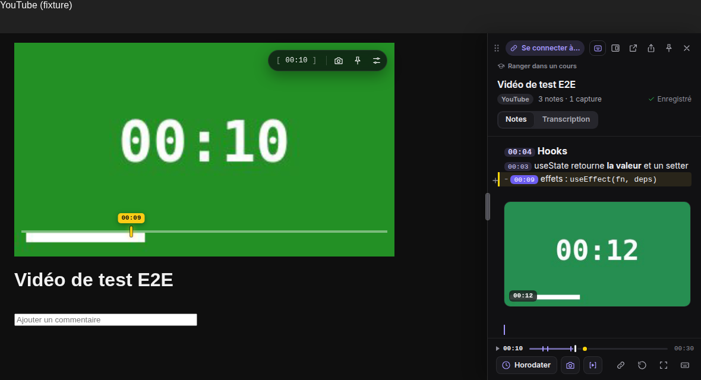

| Mini : la réplique en cours et sa traduction, sur la vidéo | Plein écran partagé : la vidéo entière, les notes à côté |
| --- | --- |
| 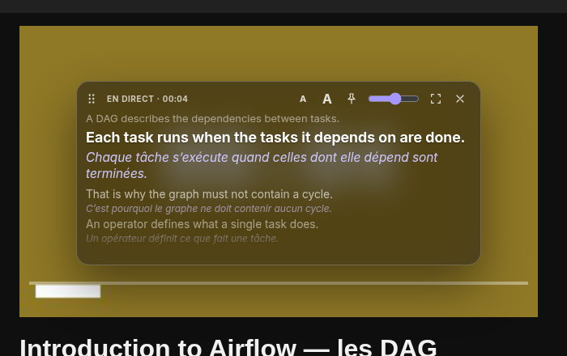 | 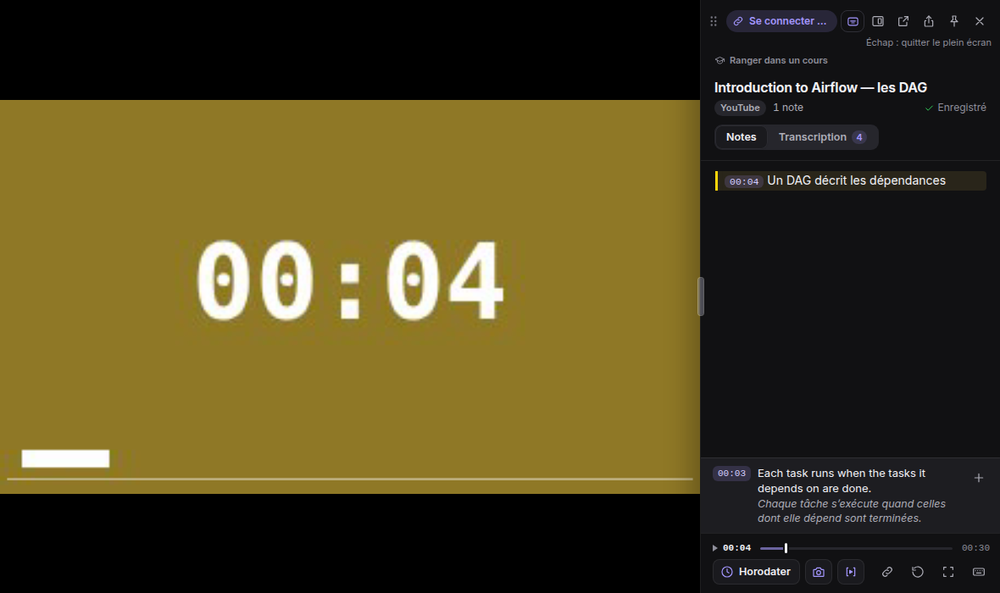 |

**Résumé** — d’après toute la transcription : problématique, objectifs, solution, plan hiérarchisé
(instants cliquables) ; et le cours entier, en grand :

| Onglet Résumé d’une leçon | Résumé du cours (page en grand) |
| --- | --- |
| 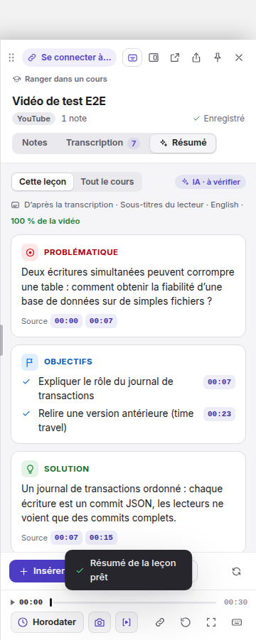 | 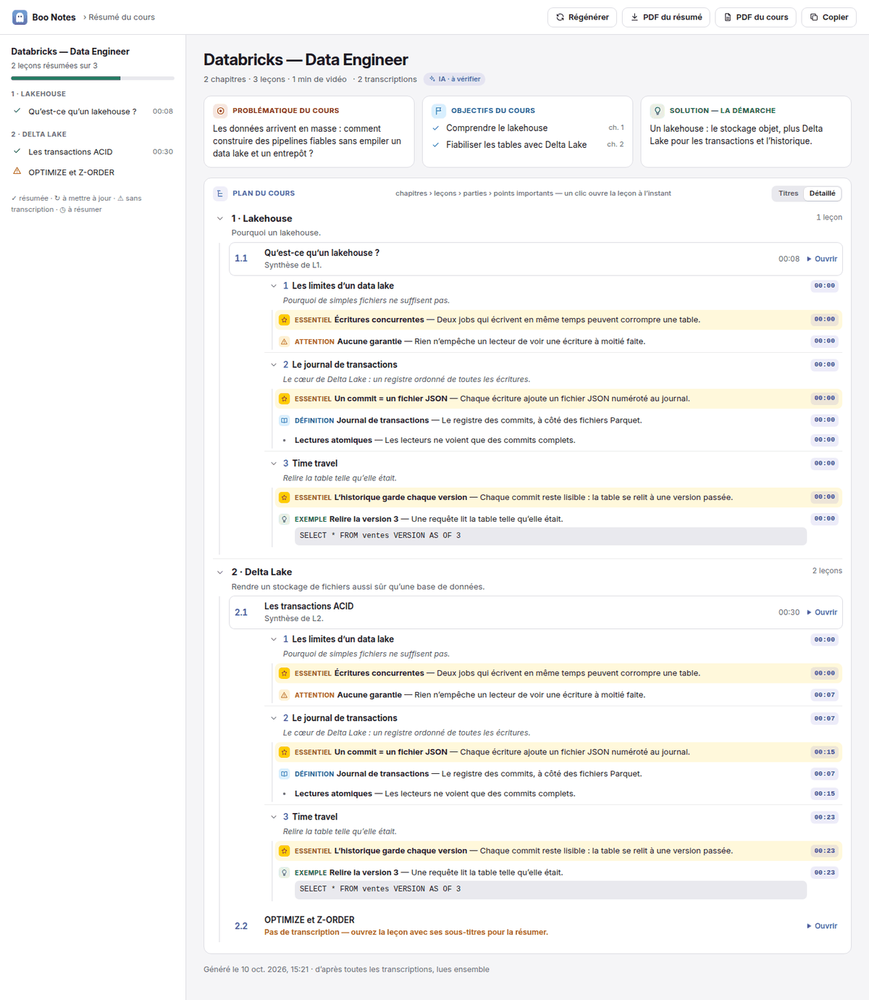 |

**Mode lecture** — un article : le passage cité est surligné dans la page et relié à sa note ;
la bulle « Citer » suit la sélection ; `[[Résistance électrique]]` relie une fiche.

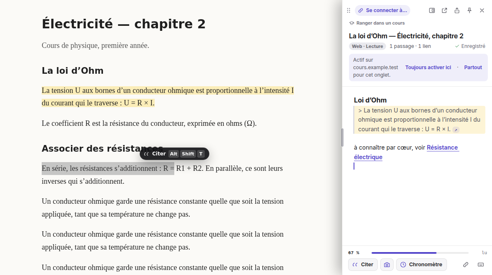

**Modules de cours (SCORM, e-learning)** — une leçon d’un LMS (Docebo / Databricks Academy,
Moodle, Cornerstone, TalentLMS…) affichée dans des cadres imbriqués (Articulate Rise / Storyline,
Captivate, iSpring) :

- la **bulle « Citer »** apparaît dans le module sur le texte sélectionné (ou `Alt+Maj+T`) ; la
  citation est liée à la leçon et **surlignée dans le module**, un clic dans la note l’y retrouve ;
- sans sélection, `Alt+Maj+T` ancre la ligne au **titre lu dans le module** ; `Alt+Maj+S` capture
  **le module seul** (pas l’en-tête du LMS) ;
- ce que le module déclare à son LMS (SCORM 1.2 / 2004, xAPI) s’affiche avec la note —
  « Module SCORM · En cours · 50 % », « Terminé · score 90 » — et compte comme **progression** de
  la leçon ;
- un cadre d’un autre site dans le module (contenu, vidéo) est signalé : **Autoriser** une fois, ou
  **Activer sur tous les sites** dans les options ; ses vidéos s’horodatent alors comme les autres.
  Un module lancé dans un cadre dont l’adresse est masquée (formulaire envoyé dans le cadre, comme
  certains LMS) est signalé aussi : **Autoriser** active alors Boo Notes sur tous les sites ;
- une vidéo au fond du module (leçon Databricks Academy : page Docebo → lanceur SCORM → pilote
  SCORM → contenu Articulate Rise, quatre cadres emboîtés) est suivie et **placée** : horodatages,
  captures recadrées sur l’image, lecteur ajusté à côté des notes ;
- les notes restent **à l’écran** : le cours mis seul en plein écran (Databricks : « Développer la
  vue de la leçon », seule façon d’y lire le cours) **reste en plein écran et affiche les notes en
  lui-même** — elles reviennent dans la page quand la vue se replie, rien de ce qui est écrit ne se
  perd ; une leçon affichée dans une boîte de dialogue modale ou un popover (top layer) accueille les
  notes, et si la page les recouvre malgré tout, elles s’ouvrent dans une **fenêtre à part** (même
  note, mêmes raccourcis) ;
- **Diagnostic de cette page** (clic droit sur l’icône Boo Notes, ou bouton dans l’aide `?` du
  panneau) : ce que Boo Notes voit de la leçon — ses cadres (LMS, module, lecteur vidéo), les vidéos
  qu’ils contiennent, l’interface SCORM, les droits accordés — et, en clair, ce qui le bloque
  (« 1 cadre de la page (…) est illisible : Autoriser »). Le rapport se copie d’un clic pour
  demander de l’aide ; il ne contient ni les notes ni les paramètres des adresses ;
- Boo Notes **mis à jour ou rechargé** pendant la leçon : l’ancienne copie retire son panneau (plus
  de panneau figé ni d’erreur « Extension context invalidated ») ; la nouvelle rouvre les notes là
  où elle peut démarrer seule (sites toujours actifs), sinon une carte invite à recharger la page.

| Note vide : le mode d’emploi | Raccourcis (`Ctrl/⌘ + /`) | Toast de capture |
| --- | --- | --- |
| 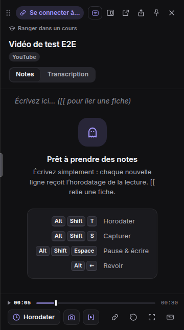 | 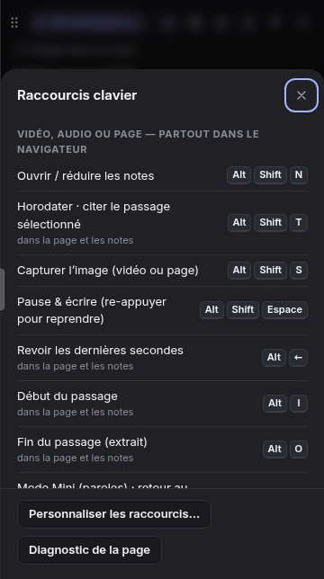 | 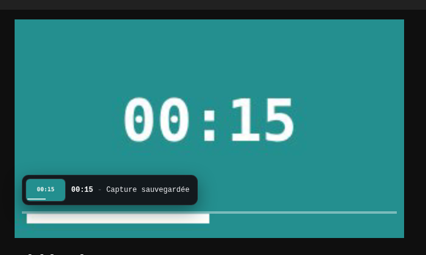 |

| Réglages | HUD et panneau flottant |
| --- | --- |
| 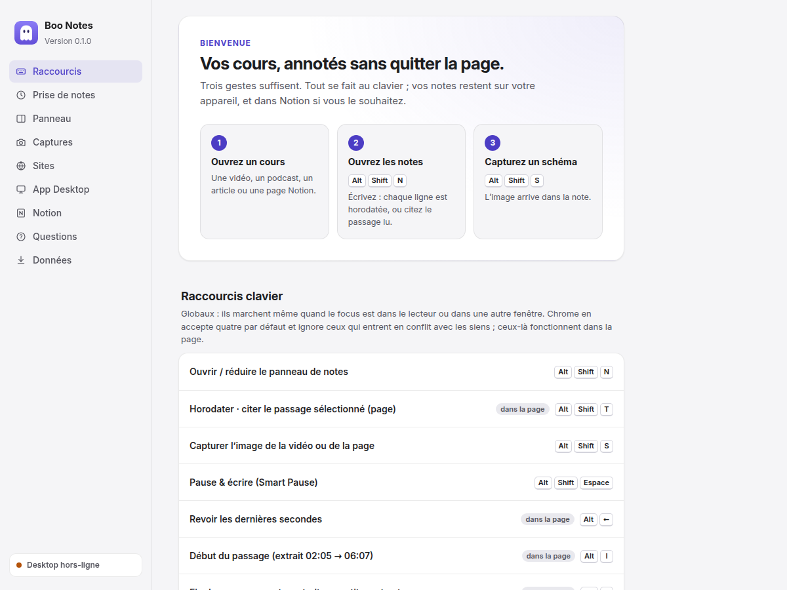 | 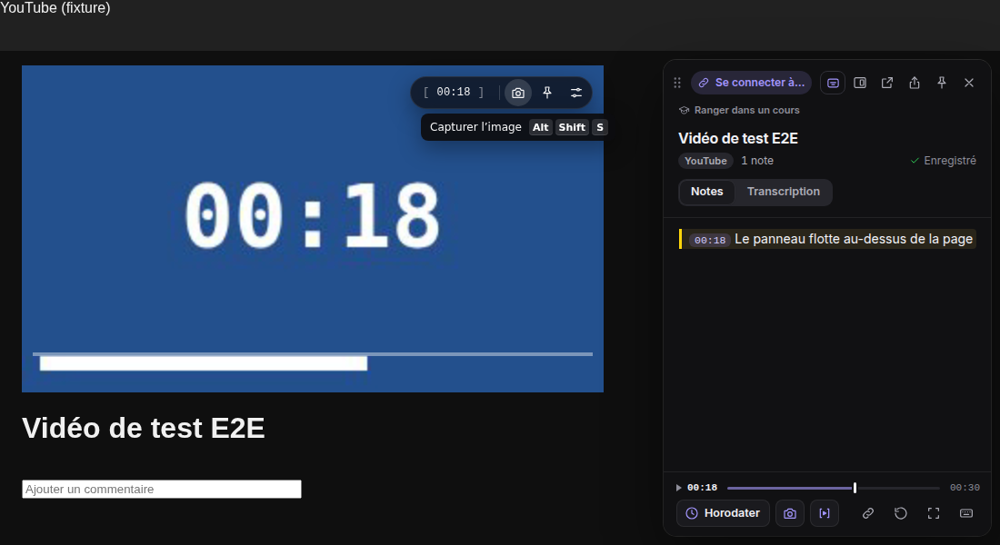 |

Extension Chrome / Chromium **Manifest V3** (TypeScript, DOM natif : légère, sans framework, pour ne
jamais alourdir les pages visitées). L’éditeur s’appuie sur **CodeMirror 6** (Markdown « à la
volée ») ; les PDF exportés sont produits avec **pdf-lib**, dans un document hors écran.

---

## Installation (développement)

```bash
npm ci
npm run build        # → dist/
```

1. Ouvrir `chrome://extensions`, activer le **mode développeur**.
2. **Charger l’extension non empaquetée** → sélectionner le dossier `dist/`.
3. Ouvrir une vidéo YouTube, une leçon Udemy ou Coursera, une page Notion, puis `Alt+Shift+N`. Sur
   tout autre site (podcast, article…), cliquer l’icône Boo Notes ou `Alt+Shift+N` active
   l’extension pour l’onglet ; « Toujours activer ici » la garde pour le site. Une page sans vidéo
   ni audio s’ouvre en **mode lecture**.

`npm run watch` reconstruit à chaque modification (recharger l’extension ensuite).

**Mettre à jour** (après un `git pull`) : `npm install && npm run build`, puis **Recharger** l’extension
dans `chrome://extensions` et recharger les onglets ouverts. Une nouvelle dépendance non installée
arrête le build avec un message clair : `dist/` n’est remplacé que par un build complet (un build
échoué ne laisse plus une extension à moitié construite, au panneau de notes vide).

## Raccourcis

| Action | Défaut | Comportement |
| --- | --- | --- |
| Ouvrir / réduire le panneau | `Alt+Shift+N` | Ouvre le panneau et donne le focus à l’éditeur ; `Échap` le referme. |
| Insérer l’horodatage | `Alt+Shift+T` | Injecte `[MM:SS]` au curseur, sans interrompre la lecture. **Mode lecture** : cite le passage sélectionné (`> texte [↗](URL#:~:text=…)`), ou, sans sélection, ancre la ligne à la section lue (`[↗ Titre](…)`). |
| Capture d’écran | `Alt+Shift+S` | Capture la frame, flash 100 ms, toast, vignette `` dans la note. **Mode lecture** : capture la partie visible de la page (le module seul pour une leçon d’un LMS). |
| Smart Pause | `Alt+Shift+Space` | Pause + focus sur une nouvelle ligne de l’éditeur ; un second appui relance la vidéo et rend le clavier au lecteur. |
| Saut arrière | `Alt+←` | Recule de 5 s (3 / 5 / 10 / 15 s au choix). |
| Début / fin du passage | `Alt+I` / `Alt+O` | Découpe un passage (02:05–06:07) : carte dans la note, extrait image + son, sous-titres et notes de l’intervalle. |
| Épingler la réplique en cours | `Ctrl+Shift+K` (`⌘⇧K`) | Dans le panneau : cite le sous-titre en cours (et sa traduction) dans la note. |
| Notes ⇄ Transcription | `Alt+T` | Dans le panneau et l’application. |
| Question ou note libre | `Ctrl+.` (`⌘.`) | Dans le panneau : le menu du **+** pour la ligne du curseur (Question, Note libre, Note normale). `Entrée` au bout d’une question la pose et continue sous le bloc ; `Entrée` sur la dernière ligne vide d’un bloc en sort. |
| Aide | `Ctrl+/` (`⌘/`) | Dans le panneau : feuille de tous les raccourcis (et `?` hors de l’éditeur). |

Les raccourcis globaux sont modifiables dans `chrome://extensions/shortcuts` (bouton dans les réglages).

> **Limites de Chrome, gérées automatiquement.** Chrome n’accepte que **4** raccourcis par défaut
> par extension et **ignore silencieusement** ceux qui entrent en conflit avec les siens —
> c’est le cas de `Alt+Shift+T` (« focus sur la barre d’outils » sous Windows / Linux). Tout
> raccourci par défaut non enregistré par Chrome est donc géré **dans la page et dans le panneau**
> (option « Raccourcis de secours dans la page », activée par défaut). Il fonctionne alors quand le
> focus est sur la vidéo ou dans les notes, mais pas depuis un autre onglet. La page d’options
> indique pour chaque action si le raccourci est global ou « dans la page ».

## Fonctionnalités (correspondance avec le cahier des charges)

| Cahier des charges | Implémentation |
| --- | --- |
| **Invisibilité** | Rien d’autre qu’un calque transparent n’est injecté tant que les notes ne sont pas ouvertes ; le HUD n’apparaît qu’au survol de la vidéo et disparaît après 2,5 s. |
| **Zéro friction** | Les 5 actions au clavier ; les raccourcis globaux fonctionnent aussi depuis le panneau, la fenêtre détachée ou un autre onglet (routés vers le lecteur actif). |
| **Non-intrusivité** | Le lecteur n’est jamais modifié : HUD, toasts, flash et marqueur sont dessinés dans un calque séparé (Shadow DOM) positionné d’après la géométrie de la vidéo. En mode « côte à côte », la page est décalée de la largeur du panneau et le panneau commence sous l’en-tête fixe de YouTube. |
| **Flow 1** | `Alt+Shift+N` → panneau + focus ; la première lettre tapée sur une ligne vide ajoute `[MM:SS]` (après `- `, `1. `, `## `, `> ` si présents) ; `Échap` ferme ou panneau laissé ouvert. |
| **Flow 2** | `Alt+Shift+S` → extraction `<canvas>` en résolution native, flash blanc 100 ms, toast `04:15 - Capture sauvegardée`, ligne `[04:15] ` rendue en vignette. |
| **Drawer** | À droite, 300–960 px selon la place laissée par la fenêtre (360 par défaut ; poignée visible au bord, à glisser, ou flèches ← → au clavier ; double-clic : largeur par défaut) ; un cours › chapitre trop long est coupé par « … » (en entier au survol), le panneau ne s’élargit jamais tout seul ; bouton **« Se connecter à… »** (Notion, app Desktop — puis le nom du coffre, point vert / orange), titre de la vidéo ou du cours, pop-out, export (Desktop, Notion — via l’app ou directement —, `.md` + captures, **PDF**, presse-papier). |
| **Éditeur** | CodeMirror 6 : Markdown rendu sur les lignes inactives (titres, gras, code, citations), horodatages cliquables, vignettes, listes continuées. |
| **HUD** | `[ 04:15 ]` copie `[04:15](URL#t=255)` ; 📸 capture ; 📌 épingle le panneau ; ⚙️ paramètres. |
| **Auto-pause (option)** | Pause après 1,5 s de frappe continue, reprise 1 s après la dernière touche — uniquement si c’est l’extension qui a mis en pause. |
| **Surbrillance bidirectionnelle** | Survol d’un horodatage → marqueur sur la barre de progression native ; pendant la lecture, la ligne du dernier horodatage atteint est surlignée dans la note. |
| **Toasts** | Bas-gauche du lecteur (au-dessus des contrôles), 2 s, sombre, mono-espace. |
| **Capture** | `<canvas>` détaché à la résolution de la vidéo ; repli sur une capture de l’onglet recadrée si la source est cross-origin sans CORS. |
| **Desktop** | WebSocket local `ws://localhost:43117` + jeton d’appairage ; stockage `chrome.storage.local` d’abord, file d’envoi rejouée à la reconnexion. Voir [docs/PROTOCOL.md](docs/PROTOCOL.md). |
| **Multi-onglets** | Un seul lecteur actif : celui qui a reçu la dernière interaction ; les raccourcis lancés ailleurs lui sont routés (un média seulement : une page en mode lecture n’est pas pilotée depuis un autre onglet). L’icône et `Alt+Shift+N` ouvrent toujours les notes **de la page affichée**. |

### Formats et sources : chaque note ramène à son origine

| Support | Ancre d’une note | Dans l’extension |
| --- | --- | --- |
| **Vidéo** | `[04:15]` → l’instant | YouTube, Udemy, Coursera, vidéos déposées dans Notion, tout site activé, **lecteurs intégrés** en iframe, lecteurs en **shadow DOM**, vidéos au fond des **modules SCORM** ; captures |
| **Audio** | `[04:15]` | Podcasts, radios, audios Notion, tout `<audio>`, lecteurs `new Audio()` hors page (auto-pause, saut arrière) |
| **Flux illisible** (DRM, application, cours en salle) | `[04:15]` → l’instant du **chronomètre** | Chronomètre lancé depuis le panneau |
| **Page web / page Notion / module de cours** | `> citation [↗](URL#:~:text=…)`, `[↗ Section](…)` → le passage, surligné | **Mode lecture** : citations, repères de section, passages surlignés dans la page, capture de la page, % lu |
| **Autre note** | `[[Titre]]` → une autre note | Liens `[[…]]` (complétion des titres, clic = ouvrir la note) |
| **Cours › chapitre** | — | Classement depuis le panneau (cours de Boo Notes Desktop proposés quand elle est connectée) |
| **Notion** | — | Envoi direct (options › Notion), ou par Boo Notes Desktop quand elle tourne |

Les PDF, fichiers vidéo / audio / texte / image locaux, notes à plusieurs supports, carte mentale et
révisions relèvent de **Boo Notes Desktop** (projet séparé) : les notes prises ici y arrivent quand
elle est connectée.

### Au-delà du cahier des charges (UX)

| | |
| --- | --- |
| **Chronologie des notes** | Dans le pied du panneau : progression de la vidéo, un trait par note, un point par capture. Survol = aperçu sur la barre du lecteur, clic ou flèches = navigation. |
| **Mise en page « transcription »** | Le texte d’une ligne horodatée s’aligne après l’horodatage ; les crochets n’apparaissent que si le curseur touche l’horodatage. |
| **Cartes de capture** | Vignette 16:9 avec badge de temps et « ▶ Revoir » au survol. |
| **Transcription en arrière-plan** | Onglet qui suit la lecture comme un karaoké, bandeau du sous-titre en cours sous les notes, traduction sur l’appareil, commentaires, passages choisis dans la transcription, intervalles `[02:05–06:07]` qui rejouent le passage et s’arrêtent à sa fin. |
| **État vide pédagogique** | Une note vide explique quoi faire et montre les 4 raccourcis en touches. |
| **Retour au bon endroit** | « ✓ Copié » sur la pilule du HUD, vignette dans le toast de capture, snackbar pour les exports, « ✓ Enregistré » dans l’en-tête. |
| **Infobulles rapides** | Sur le HUD, avec les touches (`⌥ ⇧ S` sur macOS). |
| **Panneau déplaçable** | Poignée ⠿ : flottant où on le pose (bords et coins pour le redimensionner), ancré à droite, à gauche, en haut ou en bas en le lâchant contre ce bord (zone d’ancrage allumée) ; double-clic sur la poignée : ancré ↔ flottant ; au clavier, flèches sur la poignée. Place, taille et Mini retenus **par site** (`chrome.storage.local`). |
| **Mini (paroles)** | Widget translucide (verre dépoli, opacité réglable) : réplique en cours, traduction, voisines ; épingle = fenêtre **Document Picture-in-Picture** toujours au-dessus ; ⤢ / double-clic = panneau complet, prêt à écrire. |
| **Écran partagé** | Ancré et en plein écran, la vidéo (tout le lecteur en plein écran) est réduite pour tenir à côté des notes, quel que soit leur bord — seules les propriétés CSS `scale` / `translate` du lecteur sont posées, puis retirées. En plein écran : 70 / 30 par défaut, séparateur à tirer (double-clic : 70 / 30). |
| **Côte à côte (fenêtres)** | *Désactivé (`TILING_ENABLED = false`).* La fenêtre de la vidéo et celle des notes se partagent la zone de travail de l’écran (`screen.availLeft/Top/Width/Height`), frontière commune suivie par `chrome.windows.onBoundsChanged`, état d’avant rendu à la sortie. |
| **Résumé** | Onglet du panneau : cartes Problématique (rouge) · Objectifs (bleu) · Solution (vert), plan en arbre repliable (violet) dont la partie en cours est surlignée ; états avant / pendant (étapes, plan qui grandit, attente d’un palier gratuit, « Arrêter ») / transcription partielle / à mettre à jour ; page du cours en grand (leçons et leur état sur le côté). |
| **Réglages** | Façon « Réglages système » : navigation latérale, interrupteurs, contrôles segmentés, choix visuel de la disposition, écran de bienvenue en 3 étapes. |

Détails : [docs/ARCHITECTURE.md](docs/ARCHITECTURE.md) · design & contrastes : [docs/DESIGN.md](docs/DESIGN.md).

### Liens horodatés

Les liens copiés ou exportés ont la forme demandée `URL#t=255`. Le script de contenu les interprète à
l’ouverture sur les trois plateformes (Udemy et Coursera ne gèrent pas ce fragment nativement).

## Notion et Boo Notes Desktop (application séparée)

L’extension fonctionne entièrement hors-ligne. Connectée à Notion (bouton **« Se connecter à… »**
en haut du panneau de notes › Notion : la fenêtre de Notion, « Autoriser », le nom du coffre —
« Boo Notes » par défaut —, Valider ; « Déconnecter » au même endroit), elle écrit
elle-même chaque note dans le coffre. Si l’application **Boo Notes Desktop** (projet séparé)
tourne sur la machine, les notes, captures et positions de lecture lui sont envoyées sur
`ws://localhost:43117` (« Se connecter à… » › Boo Notes Desktop : Connectée) : elles rejoignent sa
bibliothèque, et c’est elle qui écrit alors dans Notion.

- Le coffre Notion (une table, une page par cours, rien en double) et la connexion : [docs/NOTION.md](docs/NOTION.md)
- Protocole extension ↔ application : [docs/PROTOCOL.md](docs/PROTOCOL.md)

Pour développer sans l’application ni Notion, deux **mocks** : l’un implémente le protocole de
Boo Notes Desktop et écrit les notes en Markdown, l’autre imite l’API Notion :

```bash
npm run mock:desktop -- --token mon-jeton     # écrit dans ./.boo-desktop-data/
npm run mock:notion                           # http://127.0.0.1:43118, secret « secret_test »
npm run mock:notion-oauth                     # échange du code « Connecter Notion » (tools/notion-oauth)
```

## Développement

| Commande | Rôle |
| --- | --- |
| `npm run build` / `npm run watch` | Bundle esbuild → `dist/` |
| `npm run typecheck` | TypeScript strict |
| `npm test` | Tests unitaires (Vitest) : horodatage, plateformes, Markdown et repères qualifiés, cartes de révision, auto-stamp, auto-pause, raccourcis, stockage (dont le classement), synchronisation Desktop, passages d’une page, synchronisation Notion directe (API simulée), **contrastes WCAG des tokens** |
| `npm run test:e2e` | Tests de bout en bout (Playwright + Chromium avec l’extension chargée) sur une page « YouTube » locale |
| `npm run screenshots` | Régénère `docs/screenshots/` |
| `TILING_WM=1 npx playwright test tiling-wm` | « Côte à côte » dans un vrai Chrome sous un gestionnaire de fenêtres (Xvfb + openbox, voir l’en-tête du fichier) : aucune fenêtre ne bouge seule — sautés tant que la fonction est désactivée |
| `npm run fixtures` | Régénère la vidéo de test `tests/e2e/fixtures/sample.webm` |
| `npm run mock:desktop` / `npm run mock:notion` | Serveurs simulant Boo Notes Desktop et l’API Notion |
| `npm run mock:notion-oauth` | Serveur d’échange de « Connecter Notion » en local (à déployer en Cloudflare Worker : `tools/notion-oauth/README.md`) |

Les tests E2E couvrent : ouverture du panneau et horodatage automatique, `Alt+Shift+T` (y compris le
repli dans la page), Smart Pause (et sa bascule), capture + toast + vignette, `Alt+←`, HUD et copie du
lien, épinglage, plein écran (notes à côté de la vidéo, lecteur réduit, plein écran natif d’une vidéo
seule repris par son lecteur, bouton « Plein écran avec les notes »), lecteur large réduit côte à
côte, **fenêtrage du panneau** (poignée : posé n’importe où et retrouvé au retour sur le site ; zone
d’ancrage et ancrage à gauche, la vidéo entière ; carte flottante redimensionnée par ses bords ;
bande en bas et sa hauteur ; Mini : réplique, traduction, voisines, opacité, déplacement, ⤢ prêt à
écrire, `Alt+Maj+M` ; épingle « toujours au-dessus » en Picture-in-Picture ; plein écran 70 / 30 et
son séparateur, notes à gauche ; « Côte à côte » désactivé (ni dans le menu, ni dans la fenêtre des
notes, aucune fenêtre surveillée) ; taille du texte du Mini et répliques suivantes ; **page façon Udemy** : colonne fixée au
bord rangée à côté des notes, plein écran du site et du panneau identiques), **export PDF** (note, cours — ses leçons seules, leurs transcriptions — et toutes les notes : images, liens, sommaire), liens `#t=`, marqueur de prévisualisation et clic sur un horodatage,
chronologie (clic, aimantation, clavier), état vide et statistiques, feuille des raccourcis,
disposition flottante, largeur par défaut au double-clic, pop-out puis rattachement, export `.md` +
captures et copie du Markdown, persistance après rechargement, double injection du script de contenu, **mise à jour de
l’extension** pendant que les notes sont ouvertes (ancien panneau retiré, notes rouvertes, carte « Recharger »),
module lancé dans un cadre à l’adresse masquée, icône / `Alt+Shift+N` sur une leçon alors qu’une
vidéo d’un autre onglet était le lecteur actif, **diagnostic de la page** (cadres, module SCORM,
cadre à autoriser),
synchronisation hors-ligne → en ligne avec le mock Desktop, jeton refusé, auto-pause, routage
multi-onglets, **podcast audio sur un site quelconque** (activation au raccourci, horodatage,
progression, capture refusée), « Toujours activer ici » et page d’options, **vidéo déposée dans une
page Notion** (note et capture liées à la page), **mode lecture** (citation liée au passage,
surlignage dans la page, retour au passage, bulle « Citer », repère de section, progression de
lecture), **`[[liens]]`** (complétion sans accents, ouverture de la note liée), **envoi direct
vers Notion** sans l’application (connexion dans les options, API Notion simulée), **tout flux**
(vidéo dans un shadow DOM fermé, `new Audio()` hors page, lecteur dans une iframe d’un autre
domaine : horodatage, saut, capture ; lecteur non autorisé proposé à l’autorisation ; chronomètre),
le **classement cours › chapitre** depuis le panneau, et les **questions et notes libres** (le **+**
au survol seulement, son menu à la souris et au clavier ; question numérotée et renumérotée dans
l’ordre de la note, réponse compacte de l’IA avec son instant cliquable — IA de Chrome simulée,
sans IA prête (une ligne), puis l’API Claude simulée — clé, modèle, transcription et texte de la page envoyés ; note libre
sans horodatage où vont une capture et une citation de la page ; sortie d’un bloc par `Entrée` ; la
vidéo qui continue de jouer ; section IA des options), et le **résumé** (un service compatible
OpenAI simulé, palier gratuit : sa limite attendue, toute la transcription envoyée, problématique,
objectifs, solution, plan hiérarchisé, instant inventé écarté, instant cliqué, insertion en tête de
note puis remplacement ; le cours entier — chaque leçon lue, toutes les transcriptions ensemble,
leçon sans transcription signalée, page en grand, mise à jour de la seule leçon changée, PDF qui
commence par le résumé ; options › IA : les paliers gratuits et leur lien « Créer une clé
gratuite », une adresse compatible OpenAI vérifiée, ses modèles listés).

```
src/
  background/   service worker : raccourcis, routage multi-onglets, stockage, export, sync Desktop, sync Notion directe
  content/      script de contenu : détection du média (page, shadow DOM, iframes via frame.js, pont media-bridge.js), mode lecture, HUD / toasts / flash / marqueur, panneau
  panel/        page du panneau (iframe du drawer + fenêtre pop-out) : éditeur CodeMirror
  options/      page d’options
  shared/       logique pure partagée (testée unitairement)
  diagnostic/   page « Diagnostic de cette page »
  offscreen/    document hors écran : export PDF
tools/mock-desktop/   serveur WebSocket simulant l’application Boo Notes Desktop
tools/mock-notion/    API Notion simulée (tests, développement), fenêtre de consentement OAuth comprise
tools/notion-oauth/   serveur d’échange de « Connecter Notion » (Cloudflare Worker, garde le client secret)
tests/unit, tests/e2e
docs/         architecture, protocole, design, transcription, questions, Notion
```

## Limites connues

- **Contenu DRM** (Widevine, certains cours Udemy) : le navigateur renvoie une image noire ; la
  capture est enregistrée avec un avertissement. L’horodatage fonctionne (la position reste
  lisible) ; pour un lecteur totalement fermé, le **chronomètre** prend le relais.
- **Vidéo cross-origin sans CORS** : la capture passe par une capture de l’onglet recadrée, qui exige
  que Chrome ait accordé `activeTab` — c’est le cas quand la capture est lancée par le raccourci
  global, pas par le bouton du HUD (un message l’explique).
- **Sélecteurs Udemy / Coursera** (titre, barre de progression) : écrits d’après le DOM connu de ces
  plateformes mais non vérifiés sur les sites réels depuis cet environnement. Des replis existent
  (plus grande `<video>` visible, `document.title`, marqueur le long du bas de la vidéo).
- **Panneau ancré** : la page est décalée via une marge sur `<html>` (du côté de l’ancrage) ; les
  éléments en `position: fixed` calés sur ce bord (colonnes, boutons) sont décalés d’autant ; ceux
  qui couvrent toute la largeur (en-têtes) restent calés sur la fenêtre (le panneau démarre sous
  l’en-tête fixe de YouTube pour ne pas le masquer). Ancré en haut ou en bas, la page défile : un
  lecteur plus haut que la place laissée est réduit tant qu’il commence dans cette place.
- **Mini « toujours au-dessus »** : une fenêtre Picture-in-Picture de document (Chrome 116+), une à
  la fois par onglet, **opaque** (le verre dépoli n’existe que dans la page). Elle se ferme si la
  page de la vidéo est rechargée ou quittée.
- **Côte à côte (fenêtres)** — désactivé pour l’instant ; quand il est réactivé : Boo Notes suit la **frontière commune** quand on la tire ; déplacer
  une fenêtre, l’aimanter avec une autre application ou l’agrandir arrête le côte à côte (les
  fenêtres restent où on les met, rien ne bouge tout seul — la fenêtre des notes le signale). Une
  fenêtre **aimantée par Windows** (Win + ←, dispositions d’ancrage) y reste : les notes se rangent
  à côté d’elle ; pour une autre répartition, détacher d’abord la vidéo (glisser sa barre de titre),
  puis choisir la répartition. Chrome
  garde une fenêtre de navigation à au moins ≈ 510 px de large. L’extension ne place que des **fenêtres Chrome**. Partager l’écran
  avec une autre application, ou réserver une zone du bureau (barre d’application), demande
  **Boo Notes Desktop**. Une vidéo mise en plein écran sort de sa zone (le plein écran du navigateur
  prend tout l’écran) : dans une zone, le plein écran partagé du panneau fait l’équivalent.
- **Plein écran** : le HUD et le panneau sont déplacés dans l’élément plein écran (seule façon
  d’être visibles : Chrome rend inerte tout ce qui est hors de lui) puis remis en place à la sortie.
  Une `<video>` ou une iframe mise seule en plein écran ne peut rien afficher d’autre : notes
  ouvertes, son lecteur (l’élément parent) prend le relais, grâce au geste de l’utilisateur. Si ce
  geste manque (raccourci gardé par le navigateur), un message propose le bouton ⤢ du panneau.
- **Export PDF** : polices standard du PDF (Helvetica, jeu Latin-1 étendu : français, accents,
  guillemets, tirets) — les emoji sont omis et les écritures non latines remplacées par « ? » ; les
  extraits vidéo sont des **liens** vers l’instant de la vidéo (un PDF ne lit pas de vidéo).
- **Maquettes Figma** (étape 1) : ce dépôt fournit les tokens, mesures, états et captures dans
  [docs/DESIGN.md](docs/DESIGN.md) pour les reporter dans Figma ; aucun fichier Figma n’est inclus.
- **Noms de fichiers exportés** : si Chrome refuse les caractères accentués (certaines locales
  Linux), le dossier et le fichier sont renommés en ASCII (« Vidéo » → « Video »).
- **Native Messaging** : non implémenté ; seul le WebSocket local l’est.
- **Mode lecture** : une citation est retrouvée par son texte ; si la page change ce passage, le
  lien ouvre la page sans le surligner (« Passage introuvable »). Les longues citations sont liées
  par leurs 5 premiers et 5 derniers mots (fragments de texte standard, compris par Chrome, Edge et
  Safari). Le texte des iframes (modules de cours) se cite et se surligne une fois leur site
  autorisé ; un module dessiné en image ou en canvas (certaines diapositives Storyline) ne se
  sélectionne pas : capture et notes restent possibles.
- **Notion depuis l’extension** : l’accès donné par « Connecter Notion » (ou le secret de
  l’intégration) est conservé dans le stockage local de l’extension ; le bouton demande une
  intégration publique et le serveur d’échange déployés une fois (voir [docs/NOTION.md](docs/NOTION.md)).
- **Réponses aux questions et résumés** : l’IA intégrée de Chrome demande Chrome 138+ sur un
  ordinateur assez puissant et le téléchargement de son modèle ; elle écrit en anglais (traduit en
  français par le traducteur de Chrome) et lit peu à la fois (une longue vidéo : de nombreuses
  parties, plus lent). Les paliers gratuits (Groq, OpenRouter, Gemini, Mistral, Cerebras) demandent
  une clé gratuite ; leurs limites (requêtes par minute, par jour — OpenRouter : 50 par jour sans
  crédit) ralentissent le résumé d’un long cours, que Boo Notes attend sans s’arrêter. Les clés
  restent dans le stockage local ; le texte du cours part directement au service choisi. Ollama
  doit autoriser l’extension (`OLLAMA_ORIGINS=chrome-extension://*`). Le résumé demande une
  transcription (sous-titres) ; une transcription captée en partie donne un résumé partiel (dit
  avant de le lancer). Les modèles gratuits se trompent parfois : le résumé est marqué « IA · à
  vérifier ».
- **Lecteurs intégrés** (iframes) : pris en charge dès que l’extension peut lire l’hôte du lecteur
  (YouTube, et tout hôte autorisé en un clic depuis le panneau). Une iframe dans une iframe est
  pilotée, mais le HUD ne peut pas s’y superposer. Les lecteurs `new Audio()` sont vus dès leur
  prochain démarrage quand Boo Notes est activé après le début de la lecture (mettre en pause puis
  relancer), et dès le premier sur un site « toujours actif ».
- **Détection de l’extension** : le panneau étant accessible sur tous les sites (activation à la
  demande), un site peut savoir que Boo Notes est installé (voir [docs/ARCHITECTURE.md](docs/ARCHITECTURE.md)).
- **Sélecteurs Notion** (blocs vidéo / audio) : écrits d’après le DOM connu, non vérifiés sur
  notion.so depuis cet environnement ; à défaut, la plus grande vidéo ou l’audio de la page est utilisé.
- Cible : Chrome / Chromium ≥ 116 (Edge, Brave… compatibles). Firefox demanderait des adaptations.
