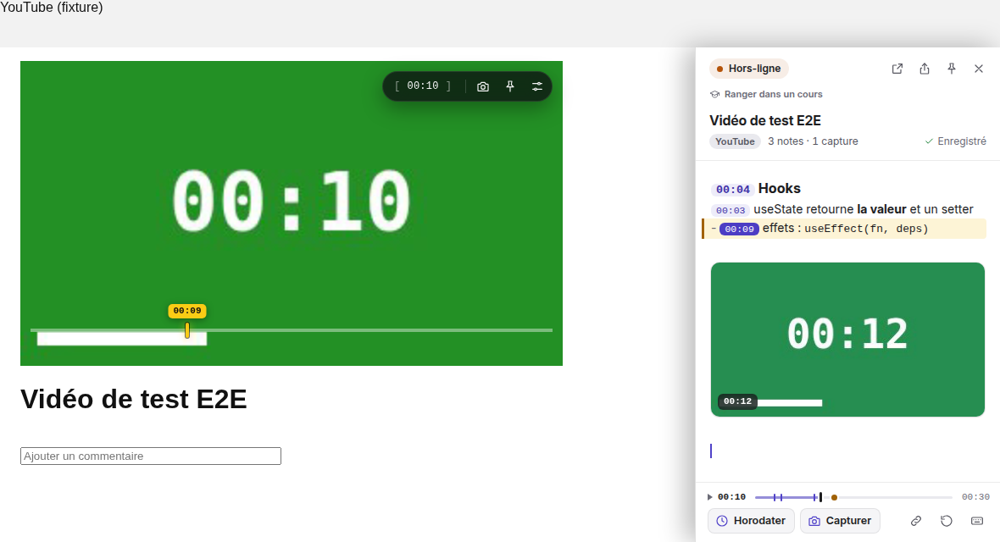
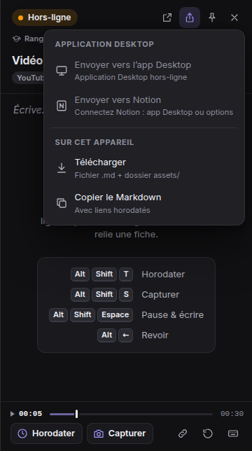
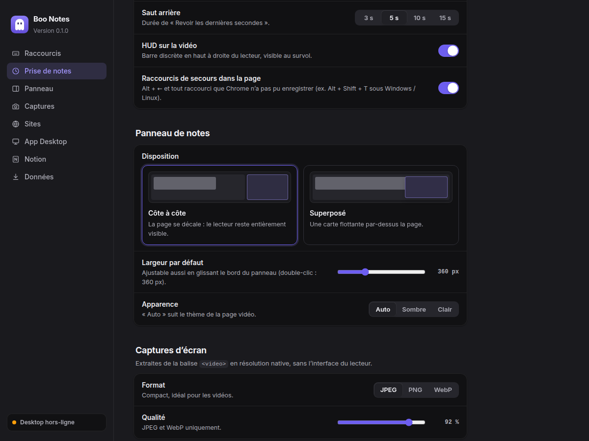

# Design — Boo Notes

Référence pour reporter l’interface dans Figma (étape 1 du cahier des charges) et pour faire évoluer
le produit. Les valeurs sont celles du code : `src/tokens.css` (panneau, réglages),
`src/content/overlay.ts` (HUD, toasts, marqueur), `src/content/drawer.ts` (drawer).

## Principes

| Principe | Traduction dans l’interface |
| --- | --- |
| **Calme par défaut** | Rien n’est visible pendant le visionnage passif. « Hors-ligne » est un état normal (local-first) : pastille teintée douce, pas d’alerte. Une seule couleur d’accent, réservée au temps et aux actions. |
| **Le retour là où l’on agit** | Copier un lien → « ✓ Copié » sur la pilule elle-même ; capturer → flash sur l’image + toast avec la vignette ; exporter → message au-dessus du pied du panneau. |
| **Apprendre en faisant** | Note vide = mode d’emploi (raccourcis en touches) ; infobulles rapides avec touches ; `Ctrl/⌘ + /` ouvre la feuille des raccourcis ; chaque bouton indique son raccourci. |
| **Le temps comme structure** | Notes en mise en page « transcription » (texte aligné après l’horodatage), chronologie des notes dans le pied du panneau, ligne « en cours » surlignée, marqueur sur la barre native. |
| **Ne jamais masquer le lecteur** | Panneau côte à côte par défaut, sous l’en-tête du site ; en superposé, carte flottante clairement au-dessus de la page. |
| **Accessible et sobre en mouvement** | Contrastes WCAG vérifiés par les tests, focus visible partout, animations courtes (120–260 ms) et désactivées avec `prefers-reduced-motion`. |

## Liquid Glass et typographie

Depuis la v2, l’application Desktop et l’extension partagent un langage inspiré de **Liquid Glass**
(Apple, WWDC 2025), défini dans `src/tokens.css` :

| Aspect | Règle |
| --- | --- |
| **Contenu d’abord** | Le contenu occupe la fenêtre ; navigation et commandes flottent au-dessus, sur du verre : `.glass` (barres, panneaux), `.glass-thick` (menus, feuilles, texte dense), `.glass-clear` (commandes sur un média). |
| **Matériau** | Teinte translucide + `backdrop-filter: blur(22px) saturate(175%)`, liseré spéculaire (1 px plus clair en haut), ombre douce. Sous Windows 11, la fenêtre est posée sur le matériau **Mica** (macOS : *vibrancy*) ; ailleurs, un fond dégradé discret donne quelque chose à réfracter. |
| **Formes concentriques** | Rayons `--radius-xs` 6 → `--radius-2xl` 28 ; un élément dans un conteneur prend *rayon du conteneur − marge*. Boutons et segments en capsule. |
| **Couleur** | Une teinte d’action (violet `--accent`), les couleurs système pour le sens : types de support (vidéo violet, audio orange, PDF rouge, image rose, fiche verte…), statuts, et une teinte par cours (arbre, cartes, bulles de la carte mentale). |
| **Mouvement** | Ressorts (`--spring-smooth`, `--spring-snappy`, `--spring-bouncy` en `linear()`, Motion côté React), courts et interruptibles ; supprimés avec « Réduire les animations ». |
| **Accessibilité** | « Réduire la transparence » rend le verre opaque, « Augmenter le contraste » renforce liserés et séparateurs ; contrastes WCAG 2.2 AA vérifiés par `tests/unit/contrast.test.ts`, y compris le texte sur verre ; tous les contrôles de l’app viennent de **React Aria** (clavier, focus, lecteurs d’écran). |

**Typographie.** `--font-sans` / `--font-display` / `--font-rounded` : **SF Pro Text**, **SF Pro
Display** (titres ≥ 20 px) et **SF Pro Rounded** (compteurs, pastilles) sur les appareils Apple, où
San Francisco est la police du système (`-apple-system`) et choisit seule ses tailles optiques. La
licence d’Apple réserve SF Pro aux logiciels pour plateformes Apple : sous Windows et Linux, Boo Notes
utilise **Inter Variable** (OFL), embarquée avec son axe de taille optique (`font-optical-sizing:
auto`), puis Segoe UI Variable. SF Compact vise les petits écrans (Apple Watch) et n’est pas
utilisée. Échelle : 11 · 12 · 14 · 16 · 20 · 24 · 30 · 38 px, approche resserrée quand la taille
grandit (`--tracking-*`, de +0,01 em à −0,024 em), chiffres tabulaires pour les temps et compteurs.

## Panneau de notes

```
┌────────────────────────────────────────┐  ← sous l’en-tête fixe du site (YouTube : 56 px)
│ (● Hors-ligne)            ⧉   ⇪   📌   ✕ │  pastille de synchro + actions (30×30)
│ Titre de la vidéo ou du cours           │  16 px / 650, 2 lignes max
│ [YouTube]  3 notes · 1 capture  ✓ Enregistré │  plateforme, statistiques, état d’enregistrement
├────────────────────────────────────────┤
│ 00:04  Hooks                            │  horodatage = puce ; titres rendus
│ 00:12  useState retourne la valeur et   │  mise en page « transcription » :
│        un setter                        │  le texte renvoyé à la ligne s’aligne
│▌- 00:31 effets : useEffect(fn, deps)    │  ▌ ligne du dernier horodatage atteint
│ ┌────────────────────────────────────┐ │
│ │       carte de capture 16:9        │ │  badge 00:45 en bas à gauche,
│ │ 00:45                    ▶ Revoir  │ │  « ▶ Revoir » au survol ; clic = y aller
│ └────────────────────────────────────┘ │
├────────────────────────────────────────┤
│ ▶ 00:47  ──|──|───●────────── 12:30    │  chronologie : traits = notes, points = captures
│ [⏱ Horodater] [📷 Capturer]      ↺  ⌨  │  actions libellées + saut arrière + aide
└────────────────────────────────────────┘
  ↔ 300–500 px (360 par défaut) ; glisser le bord, double-clic = largeur par défaut
```

| Élément | Spécification |
| --- | --- |
| Pastille de synchro | 24 px, fond teinté `--ok-soft` / `--warn-soft`, point 7 px `--ok` / `--warn` ; clic = réessayer ; infobulle : notes en attente + raison. |
| Enregistrement | « Modifié » → « Enregistrement… » → « ✓ Enregistré » (coche `--ok`) ; « Non enregistré » en `--danger` avec la raison en infobulle. |
| Puce horodatage | Mono 0,82 em, fond `--ts-bg`, texte `--ts-text`, rayon 6 ; survol : `--accent-strong` / blanc. Les crochets `[ ]` n’apparaissent que si le curseur touche l’horodatage (le texte ne « saute » pas pendant la saisie). |
| Transcription | Retrait suspendu de 52 px (66 px au-delà d’une heure) sur les lignes qui commencent par un horodatage. |
| Carte de capture | Rayon 10, ombre douce, léger soulèvement au survol ; badge horodatage mono sur fond `rgba(10,10,12,.72)` flouté. |
| Chronologie | Piste 3 px (5 px au survol / focus), progression accent 55 %, tête de lecture 3×12 px ; trait 2×9 px par note, point 7 px par capture. Survol : bulle de temps (aimantée à ± 5 px d’une note) et marqueur sur la barre du lecteur. Clavier : ← → ±5 s, Page ↑↓ ±30 s, Début / Fin. |
| État vide | Icône fantôme dans une tuile 56 px `--accent-soft`, titre, phrase d’aide, carte des 4 raccourcis (touches alignées à droite, actions à gauche). |
| Menu Exporter | Carte 12 px, ombre `--shadow-l`, deux groupes (« Application Desktop » / « Sur cet appareil »), sous-titre par action ; hors-ligne, les actions Desktop sont désactivées et le sous-titre dit pourquoi. |
| Snackbar | Pilule sombre `#26262c` au-dessus du pied, icône verte (succès) / ambre (erreur), 3 s (5 s pour une erreur). |
| Feuille des raccourcis | Feuille qui monte du bas (iOS), fond flouté, groupes Vidéo / Éditeur / Markdown, piège de focus, `Échap` ferme sans fermer le panneau. |

**Disposition** : *côte à côte* (défaut, la page est décalée, le lecteur reste entièrement visible)
ou *superposé* : carte flottante (marges 10 px, rayon 14 px, ombre portée). En plein écran, le panneau
épinglé est toujours une carte flottante.

**Thème** : automatique d’après le fond de la page (YouTube sombre → panneau sombre), ou forcé.

## Sur la vidéo

| Élément | Spécification |
| --- | --- |
| HUD | Pilule en haut à droite du lecteur (marge 12 px), fond `rgba(18,18,22,.8)` + flou 14 px, boutons 30×30. Entrée : fondu 160 ms + glissement ressort 220 ms. Visible au survol, masqué après 2,5 s d’inactivité. |
| Infobulles du HUD | Après 280 ms de survol (ou au focus clavier) : libellé + touches (`⌥ ⇧ S` sur macOS). |
| Copie du lien | La pilule affiche « ✓ Copié » (vert) pendant 1,4 s puis revient au temps. |
| Flash de capture | Blanc, opacité 0,9 → 0 en **100 ms**, limité à l’image (bandes noires exclues). |
| Toast | Bas-gauche du lecteur, 10 px au-dessus de la barre de progression ; 2 s ; mono 12 px `04:15 - Capture sauvegardée` ; vignette 64×36 de la capture (repli sur une icône si le site bloque les images `data:`) ; entrée en ressort, 3 toasts max. |
| Marqueur | Trait jaune `#facc15` 4×18 px sur la barre native + étiquette `03:12`. |

## Réglages

Mise en page « Réglages système » : barre latérale (icônes + scrollspy, état Desktop en bas), cartes
groupées, lignes libellé + description à gauche / contrôle à droite.

- **Bienvenue** (premier lancement) : titre, promesse, 3 étapes numérotées avec les vraies touches.
- **Contrôles** : interrupteurs (`role="switch"`), contrôles segmentés (saut arrière 3 / 5 / 10 / 15 s,
  apparence, format de capture), sélecteur visuel de disposition (mini-schémas), curseurs avec valeur.
- **Application Desktop** : carte d’état (pastille, version, notes en attente, raison), jeton masquable.
- **Zone de danger** séparée pour l’effacement des données.
- Sous 820 px, la barre latérale devient une barre d’onglets horizontale.

## Tokens et contrastes (WCAG 2.2)

Vérifiés automatiquement par `tests/unit/contrast.test.ts` (texte ≥ 4,5:1, composants ≥ 3:1).

| Token | Sombre | Clair | Contraste sur `--bg` (sombre / clair) |
| --- | --- | --- | --- |
| `--bg` | `#141417` | `#ffffff` | — |
| `--surface` | `#1b1b20` | `#f6f6f8` | — |
| `--elevated` (menus, feuilles) | `#222228` | `#ffffff` | — |
| `--text` | `#ededf2` | `#1d1d1f` | 15,8 / 16,8 |
| `--muted` | `#a6a6b3` | `#56565f` | 7,6 / 7,3 |
| `--faint` (placeholder, marqueurs Markdown) | `#8c8c99` | `#6b6b76` | 5,5 / 5,3 |
| `--accent` (liens, notices) | `#9b8cff` | `#5143c9` | 6,6 / 7,0 |
| `--ts-text` sur `--ts-bg` (puce horodatage) | `#cdc5ff` | `#3f32a8` | 9,0 / 8,1 |
| `--on-accent` sur `--accent-strong` | `#fff` / `#6d5ef0` | `#fff` / `#4c3dc4` | 4,7 / 7,6 |
| `--danger` | `#f87171` | `#b91c1c` | 6,6 / 6,5 |
| `--ok` (Connecté, Enregistré) | `#22c55e` | `#15803d` | 8,1 / 5,0 |
| `--warn` (Hors-ligne) | `#f59e0b` | `#b45309` | 8,6 / 5,0 |
| `--focus` (anneau de focus) | `#a5b4fc` | `#4f46e5` | 9,2 / 6,3 |
| `--now-border` | `#facc15` | `#a16207` | 12,0 / 4,9 |

Séparateurs : `--hairline` (blanc / noir à 7 %). Rayons : 6 (puces), 8 (boutons), 10 (cartes de
capture), 12–14 (menus, cartes), 16 (feuille), pilule. Mouvement : `--dur-fast` 120 ms, `--dur`
180 ms, `--dur-slow` 260 ms ; courbes `--ease-out` et `--ease-spring`.

Typographie : `system-ui` (SF Pro sur macOS, Segoe UI Variable sous Windows) ; échelle 11 / 12 / 14 /
16 / 20 ; `ui-monospace` pour horodatages, chronologie, HUD et toasts (chiffres tabulaires).

## Accessibilité

- Tous les boutons ont un nom accessible ; ceux qui ont un raccourci l’annoncent.
- HUD : `role="toolbar"`, `inert` quand il est caché ; infobulles au focus clavier aussi.
- Chronologie : `role="slider"` avec `aria-valuenow` / `aria-valuetext` (« 04:15 sur 12:30 »).
- Menu d’export : `role="menu"`, flèches, `Échap` rend le focus au bouton.
- Feuille des raccourcis : `role="dialog"`, `aria-modal`, piège de focus, retour du focus à la fermeture.
- Toasts et snackbar : `role="status"`, `aria-live="polite"`.

## Captures

`npm run screenshots` régénère :

| | |
| --- | --- |
|  |  |
|  |  |
|  |  |
|  |  |
|  | |
