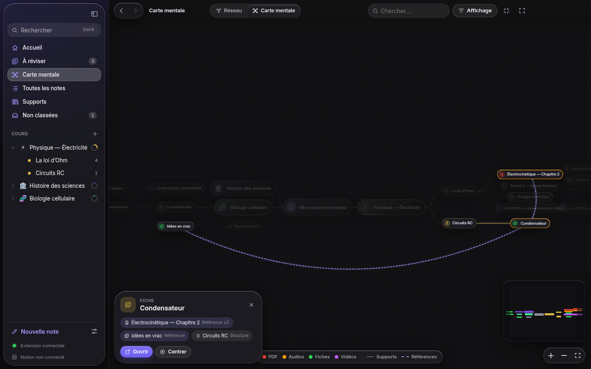
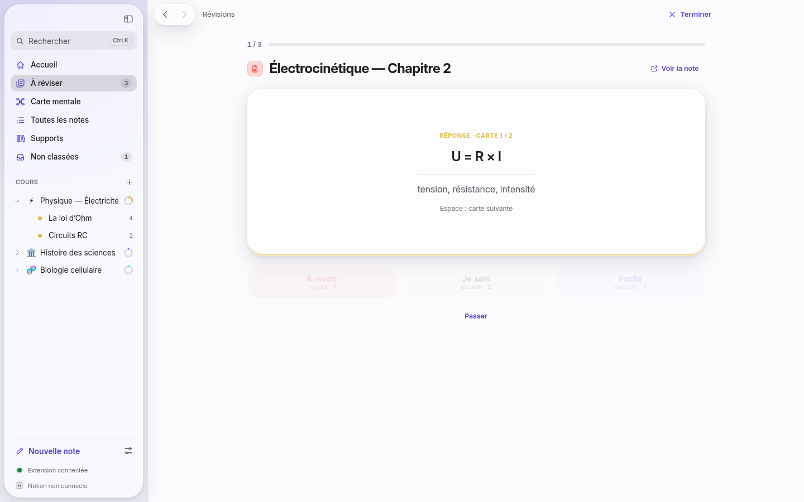
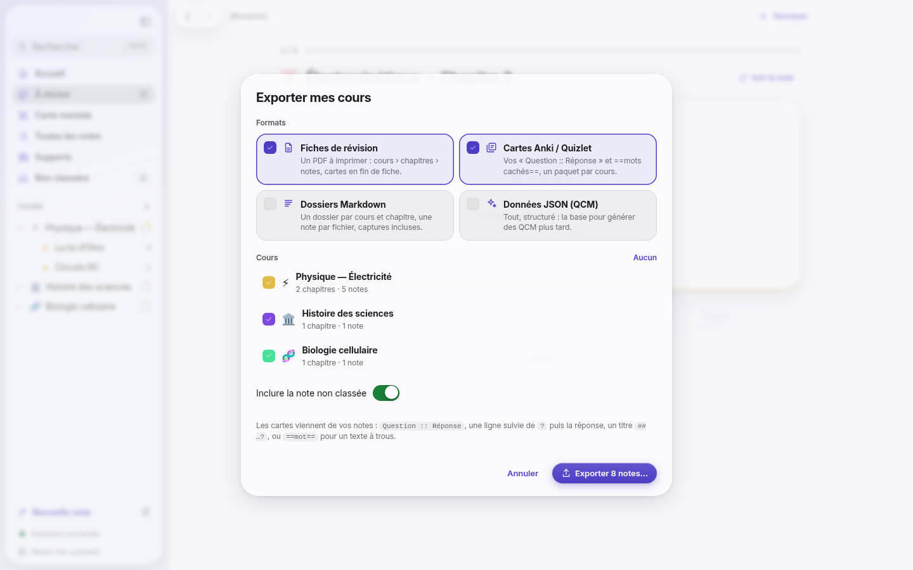

# Boo Notes Desktop (Windows)

L’application Desktop est votre **second cerveau d’étudiant** : des **cours** découpés en
**chapitres**, des **notes** dans chaque chapitre, et chaque note reliée à **un ou plusieurs
supports** — vidéos, audios, flux en direct, PDF, images, textes, pages web — ainsi qu’aux autres
notes par des `[[liens]]`. La **carte mentale** dessine le tout ; les **révisions** et l’**export**
(fiches PDF, cartes Anki, données pour QCM) en font des outils de révision ; **Notion** en garde une
copie.


| Un cours, ses chapitres et ses notes | Une note, deux supports (PDF + enregistrement) |
| --- | --- |
|  |  |

| Carte mentale — réseau groupé par cours | Carte mentale — vue arborescente |
| --- | --- |
|  |  |

| Révision : cartes à retourner | Export : fiches, Anki, Markdown, JSON |
| --- | --- |
|  |  |

## Installer

**Programme d’installation Windows** (x64) : onglet *Actions* du dépôt › workflow **Desktop** ›
artefact `Boo-Notes-Setup-Windows` (`Boo-Notes-Setup-<version>-x64.exe`). Installation par
utilisateur, sans droits administrateur ; raccourcis Bureau et menu Démarrer.

Tant que l’installeur n’est pas signé, Windows SmartScreen affiche « Éditeur inconnu » :
**Informations complémentaires › Exécuter quand même**. Pour signer, renseignez les secrets
`WIN_CSC_LINK` (certificat .pfx en base64) et `WIN_CSC_KEY_PASSWORD` du dépôt.

**Construire soi-même** (sous Windows, Node.js 22) :

```powershell
npm ci                 # à la racine : l’éditeur est partagé avec l’extension
cd desktop
npm ci
npm run dist:win       # → desktop\release\Boo-Notes-Setup-<version>-x64.exe  (ajoutez -- --arm64 pour ARM)
```

Sous Linux / macOS, `npm run dist:dir` produit l’application non empaquetée ; l’installeur NSIS
Windows demande Windows (ou Wine).

## Premier lancement

Une présentation en quatre écrans explique le modèle (cours › chapitres › notes ↔ supports), affiche
le **jeton d’appairage** de l’extension (ex. `K7QX-M2PA-9TRZ-HW4C`, adresse `ws://localhost:43117`)
et propose de créer le premier cours. Dans l’extension : **Réglages › App Desktop**, collez le jeton ;
« Extension connectée » s’allume en bas de la barre latérale. Notion se connecte dans **Réglages ›
Notion** ([guide](NOTION.md)).

L’application reste dans la **zone de notification** quand on ferme la fenêtre (réglable) pour que
l’extension puisse toujours lui envoyer les notes ; « Lancer au démarrage de Windows » la démarre
discrètement à l’ouverture de session.

## Cours › chapitres › notes ↔ supports

| Élément | Ce que c’est | Où |
| --- | --- | --- |
| **Cours** | Un sujet : icône, couleur, un ou plusieurs chapitres, progression | Barre latérale (arbre), page du cours |
| **Chapitre** | Une partie ordonnée du cours ; contient des notes, dans l’ordre | Page du cours (glisser-déposer pour réordonner) |
| **Note** | Du Markdown : texte, repères, citations, cartes, `[[liens]]` | Un fichier `.md` dans le dossier de notes |
| **Support** | Vidéo, audio, flux, PDF, image, texte, page web — local, par adresse ou vu dans le navigateur | **Supports** (bibliothèque) ; partageable entre plusieurs notes |

- **Créer** : « Nouveau cours » (barre latérale, accueil), « Ajouter un chapitre », « Note » dans un
  chapitre, `Ctrl+N` (dans le chapitre ouvert), fichiers déposés dans la fenêtre ou `Ctrl+O` (une
  note par fichier, rangée dans le cours ouvert), `Ctrl+Shift+O` pour un flux par son adresse.
- **Ranger** : glisser une note sur un cours ou un chapitre de la barre latérale, la réordonner dans
  son chapitre, ou choisir cours et chapitre dans l’**inspecteur** de la note. « Non classées »
  rassemble les notes sans cours. Les notes prises dans le navigateur arrivent dans le cours choisi
  depuis le panneau de l’extension (le plus récent des deux classements l’emporte).
- **Plusieurs supports par note** : « Lier un support » (inspecteur, ou `+` au-dessus du lecteur)
  propose des fichiers, une adresse ou un support déjà dans la bibliothèque. Chaque support a son
  onglet et son numéro (pastille colorée). Les repères d’une note ciblent leur support :
  `[04:15]` renvoie au support principal, `[04:15](res:…)` à un autre — les puces portent alors le
  numéro du support, et un clic change d’onglet et va au bon endroit. Changer le support principal
  (menu du support › « Définir comme principal ») réécrit les repères pour qu’ils visent toujours le
  même endroit.

## Étudier : un support, ses gestes

| Support | Repère | Gestes |
| --- | --- | --- |
| **PDF** | `[p. 12]` | Chaque ligne commence par la page lue ; surligner (4 couleurs, `Alt+Shift+H`), citer (`Alt+Shift+Q`), pastilles de notes dans la marge, zoom `Ctrl` + molette / `Ctrl 0` |
| **Vidéo / audio** | `[04:15]` | Chaque ligne horodatée ; `Alt+Shift+T` horodate, `Alt+Shift+S` capture l’image, `Alt+Shift+Espace` lecture / pause, `Alt+←` recule de 5 s, vitesse 0,75–2×, pause pendant la frappe, reprise là où vous étiez |
| **Flux par adresse** | `[04:15]` | Vidéo ou audio direct (`.mp4`, `.webm`, `.mp3`, `.wav`…), **HLS** (`.m3u8`, direct), radio / podcast (Icecast…), PDF ou image en ligne : lus dans l’app via le protocole interne (reprise de lecture, recherche dans le flux) |
| **Texte** (.txt, .md) | `[§ 4]` | Paragraphes numérotés, clic dans la marge = note sur le paragraphe, citations |
| **Image** (graphe, schéma) | `[pin 3]` | Double-clic ou `Alt+Shift+T` puis clic : repère numéroté ; zoom, déplacement ; clic repère ↔ note |
| **Page d’une plateforme** (YouTube, Udemy, Coursera…) | — | « Reprendre à 21:00 » / « Ouvrir » dans le navigateur, où l’extension prend les notes |

Le **temps d’étude** (fenêtre au premier plan, activité récente) et la **progression** (≥ 95 % d’un
média, dernière page d’un PDF = Terminé) sont enregistrés ; le statut se force dans l’inspecteur.

## Liens, carte mentale et second cerveau

- Dans toute note, `[[` propose les titres (sans tenir compte des accents) ; `[[Titre]]` : survol =
  aperçu, clic = ouvrir (créée si elle n’existe pas). L’inspecteur liste **Liens** et **Liée depuis**.
- **Carte mentale** (`Ctrl+Shift+G`, ou depuis un cours / une note) :
  - **Réseau** : cours, chapitres, notes et supports ; liens de structure, notes → supports et
    références `[[…]]` (pointillés). Les nœuds sont **regroupés par cours** (ou par type de support,
    ou sans groupe) dans des bulles colorées que l’on **déplace d’un bloc** par leur étiquette.
    Un cours ou un chapitre se **replie** (bouton de la bulle ou du nœud) : ses liens remontent au
    nœud replié, avec leur nombre — la vue d’ensemble des relations *entre cours*.
  - **Carte mentale** : « Mon second cerveau » au centre, cours → chapitres → notes → supports
    répartis à gauche et à droite ; chaque branche se replie ; déplacer un nœud emporte sa branche.
  - Recherche (les résultats restent vifs, le reste s’estompe), survol / sélection = voisinage mis
    en avant, fiche du nœud (liens, « Ouvrir », « Centrer », « Replier », « Épingler »), filtres
    (chapitres, notes, supports, familles de liens), mini-carte, légende. Double-clic ou `Entrée` =
    ouvrir ; `Échap` = désélectionner. Les nœuds déplacés restent épinglés (« Réorganiser » libère tout).

## Réviser

- **Cartes** écrites dans les notes : `Question :: Réponse`, une ligne suivie de `?` puis la réponse,
  un titre `## Question ?` suivi de la réponse, ou `==mot==` pour un texte à trous. L’inspecteur les
  montre ; l’export les emporte.
- **Révision espacée** : « Ajouter aux révisions » (inspecteur, bouton « Réviser » de la note).
  **À réviser** lance la session du jour : chaque note montre ses cartes (`Espace` = retourner /
  suivante), ou son texte à relire, puis **À revoir** (demain), **Je sais** (palier suivant),
  **Facile** (deux paliers) — touches `1`, `2`, `3`. Paliers : 1, 3, 7, 14, 30, 60, 120 jours ;
  trois réussites d’affilée = Terminé. « S’entraîner quand même » repasse les notes à venir.

## Exporter

`Ctrl+Shift+E` (ou menu d’un cours › « Exporter ce cours ») : choisissez les **cours** et les
**formats**, puis un dossier.

| Format | Contenu |
| --- | --- |
| **Fiches de révision** | `Fiches de révision.pdf` (+ `.html`) : cours › chapitres › notes, repères lisibles, captures, cartes en fin de fiche — prêt à imprimer |
| **Cartes Anki / Quizlet** | `Cartes - questions (Anki).txt` et `Cartes - textes à trous (Anki).txt` : un paquet par cours (`Boo Notes::Cours`), étiquettes cours / chapitre / note, à importer tel quel dans Anki |
| **Dossiers Markdown** | Un dossier par cours et chapitre, une note par fichier (front matter : cours, chapitre, supports), captures, `README.md` sommaire |
| **Données JSON (QCM)** | `boo-notes.json` : cours, chapitres, notes (texte, liens, repères), supports, cartes — la base pour générer des QCM |

## Cours pris en notes dans le navigateur

Les notes de l’extension arrivent automatiquement avec la progression et le **cours › chapitre**
choisi dans le panneau (cours et chapitres créés au besoin). Elles se lisent dans l’application
(horodatages et citations `↗` rouvrent le navigateur au bon endroit) et se modifient dans
l’extension. L’application envoie à l’extension ses **titres** (complétion `[[`), ses **cours et
chapitres** (pour ranger depuis le navigateur) et, si vous le souhaitez, sa **connexion Notion**.

## Dossier de notes

Par défaut `Documents\Boo Notes` (modifiable ; l’extension renvoie alors toutes ses notes) :

```
Boo Notes/
  Électrocinétique — Chapitre 2.md   une note : front matter YAML + Markdown
  Condensateur.md
  assets/                             captures (extension, vidéos, flux)
  .boo/library.json                   cours, chapitres, notes, supports, progression, surlignages,
                                      repères, révisions, correspondance Notion (format v2 ; v1 migré)
```

Les fichiers `.md` s’ouvrent dans n’importe quel éditeur (Obsidian, VS Code…).

## Interface : frameworks et design

- **React 19** et **React Aria Components** (Adobe) : chaque contrôle — menus, listes, arbre des
  cours avec glisser-déposer, onglets, sélecteurs, feuilles modales, infobulles — a le clavier, le
  focus et l’accessibilité (lecteurs d’écran) d’un contrôle natif. **Motion** pour les animations à
  ressort (réduites avec « Réduire les animations »), **Zustand** pour l’état, **React Flow** +
  **d3-force** / **d3-hierarchy** pour la carte mentale. Le lecteur PDF (pdf.js), l’éditeur
  (CodeMirror 6, partagé avec l’extension) et les lecteurs média / image / texte restent des
  composants impératifs éprouvés, montés dans React (« îlots »).
- **Liquid Glass** (Apple, 2025) : le contenu occupe la fenêtre ; barre latérale, barres d’outils,
  menus et feuilles flottent sur du verre translucide (flou + saturation, liseré spéculaire), sur le
  matériau **Mica** de Windows 11 (ou la *vibrancy* de macOS) ; rayons concentriques, une seule
  teinte d’action, couleurs système pour le sens. Opaque avec « Réduire la transparence »,
  contrasté avec « Augmenter le contraste ».
- **Typographie** : **SF Pro** (Text / Display, tailles optiques, et SF Pro Rounded pour les
  compteurs) sur les appareils Apple, où c’est la police du système. Sa licence interdit de
  l’embarquer dans une application pour Windows : l’app y utilise **Inter Variable** (dessinée dans
  le même esprit, axe de taille optique), incluse, puis Segoe UI Variable. SF Compact, pensée pour
  les petits écrans de l’Apple Watch, n’a pas sa place dans une application de bureau.

## Sécurité et vie privée

- Le serveur de l’extension n’écoute que sur `127.0.0.1` et refuse toute connexion dont l’en-tête
  `Origin` n’est pas celui d’une extension ; le **jeton d’appairage** est obligatoire (« Nouveau
  jeton » déconnecte les navigateurs appairés).
- Le secret Notion est chiffré avec le coffre du système (`safeStorage` : DPAPI sous Windows).
- Interface isolée : `contextIsolation`, `sandbox`, pas de Node.js dans l’interface, API minimale
  exposée par le script de préchargement, politique CSP stricte ; l’interface, les médias, les flux
  ajoutés par adresse et les captures sont servis par un protocole interne `boo://app/` qui n’expose
  que les fichiers et adresses de la bibliothèque. Les liens s’ouvrent dans le navigateur.
- Aucune télémétrie. Connexions sortantes : Notion (si connecté), les flux que vous ajoutez, les
  miniatures YouTube.

## Architecture

```
desktop/src/
  core/          logique sans Electron (testée unitairement)
    library.ts     cours, chapitres, notes, supports ; dossier de notes ; migration v1 → v2
    views.ts       instantané affiché (statuts, progression, cours) ; export.ts : fiches, Anki, Markdown, JSON
    server.ts      WebSocket de l’extension (protocole v1, docs/PROTOCOL.md)
    notion/        client REST, Markdown → blocs, synchronisation
  main/          processus principal : fenêtre (Mica / vibrancy), zone de notification, IPC, protocole boo://
  preload/       pont typé window.boo (contextBridge)
  renderer/      interface React
    shell/         App, barre latérale, palette de commandes, barre d’outils
    views/         Accueil, notes, cours, note (+ inspecteur), supports, carte mentale (graph/), révisions, réglages, export
    islands/       éditeur CodeMirror et lecteurs (PDF, média, image, texte) montés dans React
    ui/            boutons, champs, menus, feuilles, toasts (React Aria + Liquid Glass)
    styles/        app.css (+ composants, vues, graphe, lecteurs) sur src/tokens.css
  ipc.ts         contrat interface ↔ processus principal
```

## Développement

```bash
cd desktop
npm ci
npm start                    # build + lance l’application
npm run watch                # rebuild continu (relancer l’app)
npm run typecheck
npm test                     # unitaires : bibliothèque v2, graphe (regroupement, repli, carte), serveur, Markdown → Notion, synchro Notion
npm run test:ui              # Playwright + Electron (sous Linux : xvfb-run -a npm run test:ui)
SCREENSHOTS=1 npm run test:ui -- screenshots   # régénère docs/screenshots/desktop-*.png
npm run icons                # régénère build/icon.ico et les icônes de la zone de notification
```

Les tests d’interface couvrent : présentation et jeton, cours › chapitres (création, glisser-déposer,
inspecteur), note à deux supports (repères qualifiés, pastilles), flux par adresse, PDF (pages,
surlignage, citation), audio, vidéo (capture), texte, image (repères), fiches et `[[liens]]`,
révision de cartes, carte mentale (groupes, repli, recherche, arborescence), export (PDF, Anki,
JSON), notes de l’extension rangées dans leur cours, Notion (colonne Cours).

Variables utiles : `BOO_USER_DATA` (dossier des réglages), `BOO_VAULT` (dossier de notes),
`BOO_PORT` (port de l’extension), `BOO_EXPORT_DIR` (dossier d’export, sans boîte de dialogue),
`NOTION_API_BASE` (API Notion simulée).
