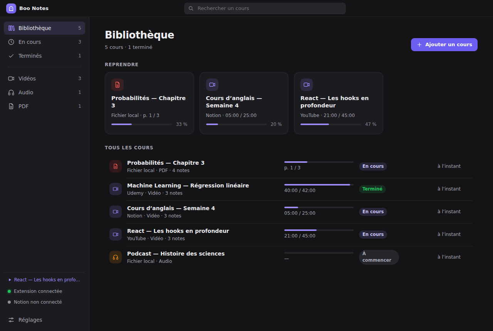
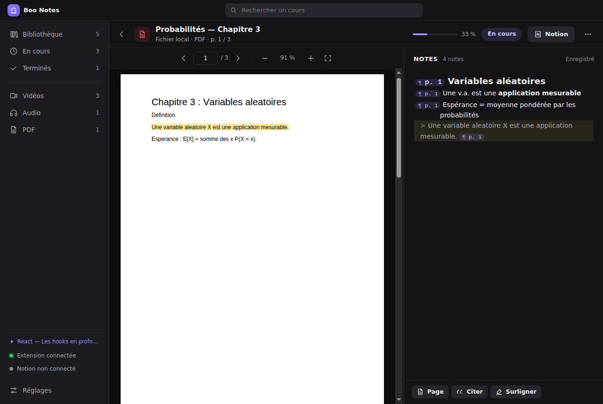
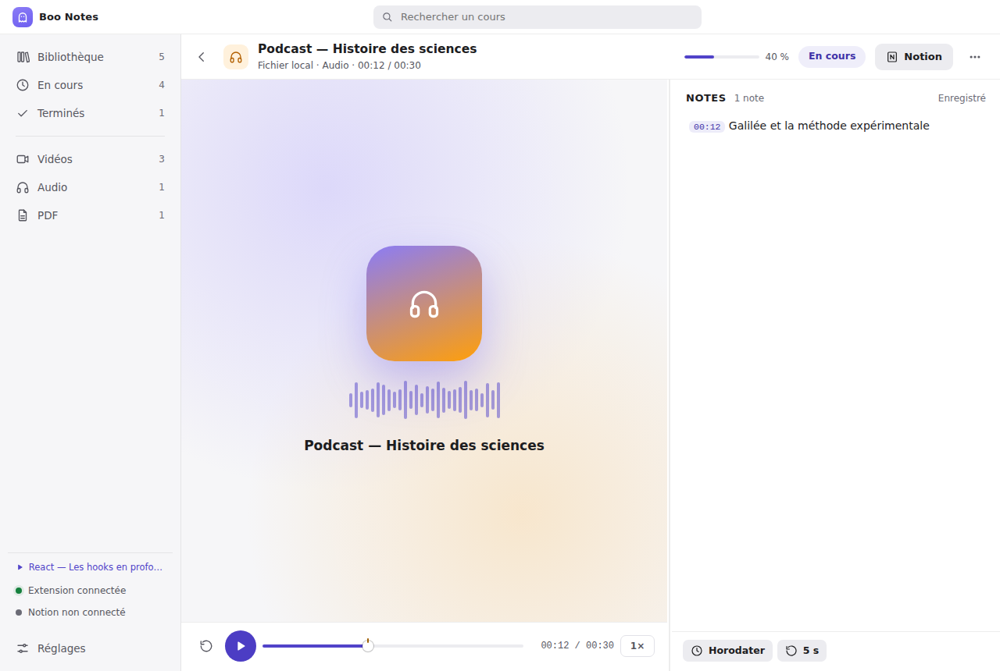

# Boo Notes Desktop (Windows)

L’application Desktop réunit tout ce que vous étudiez : les cours pris en notes dans le navigateur
(YouTube, Udemy, Coursera, pages et vidéos Notion, articles, podcasts…), vos **fichiers locaux** —
PDF, textes, images (graphes, schémas), audio, vidéo — et vos **fiches de révision**, reliées entre
elles, avec le suivi de progression, la révision espacée et la synchronisation **Notion**.



| Lecteur PDF : notes par page, surlignage, citation | Audio local : notes horodatées |
| --- | --- |
|  |  |

## Installer

**Programme d’installation Windows** (x64) : onglet *Actions* du dépôt › workflow **Desktop** ›
artefact `Boo-Notes-Setup-Windows` (`Boo-Notes-Setup-<version>-x64.exe`). Installation par
utilisateur, sans droits administrateur ; raccourcis Bureau et menu Démarrer.

Tant que l’installeur n’est pas signé, Windows SmartScreen affiche « Éditeur inconnu » :
**Informations complémentaires › Exécuter quand même**. Pour signer, renseignez les secrets
`WIN_CSC_LINK` (certificat .pfx en base64) et `WIN_CSC_KEY_PASSWORD` du dépôt.

**Construire soi-même** (sous Windows, Node.js 22) :

```powershell
npm ci                 # à la racine : l’éditeur est partagé avec l’extension
cd desktop
npm ci
npm run dist:win       # → desktop\release\Boo-Notes-Setup-<version>-x64.exe  (ajoutez -- --arm64 pour ARM)
```

Sous Linux / macOS, `npm run dist:dir` produit l’application non empaquetée ; l’installeur NSIS
Windows demande Windows (ou Wine).

## Premier lancement

1. L’écran d’accueil affiche le **jeton d’appairage** (ex. `K7QX-M2PA-9TRZ-HW4C`).
2. Dans l’extension : **Réglages › App Desktop**, adresse `ws://localhost:43117`, collez le jeton.
   Le point vert « Extension connectée » apparaît dans la barre latérale de l’application et le
   badge du panneau de l’extension passe au vert.
3. Glissez un PDF, un texte, une image, un audio ou une vidéo dans la fenêtre (ou `Ctrl+O`), ou
   créez une fiche (`Ctrl+N`).
4. Facultatif : **Réglages › Notion** ([guide](NOTION.md)).

L’application reste dans la **zone de notification** quand on ferme la fenêtre (réglable) afin que
l’extension puisse toujours lui envoyer les notes ; « Lancer au démarrage de Windows » la démarre
discrètement à l’ouverture de session.

## Bibliothèque

- **Reprendre** : les cours en cours, les plus récents d’abord, avec leur position.
- **Tous les cours** : type, plateforme, nombre de notes, progression, statut, état Notion.
- Filtres latéraux (À réviser, En cours, Terminés, Fiches, Vidéos, Audio, PDF, Images, Textes,
  Pages web), recherche `Ctrl+F`, **Nouvelle fiche** (`Ctrl+N`).
- Menu « ⋯ » : envoyer / ouvrir dans Notion, afficher la note `.md`, marquer comme terminé,
  retirer de la bibliothèque.
- En bas de la barre latérale : état de l’extension (et le cours en lecture dans le navigateur),
  état de Notion.

Le **statut** est déduit de la progression (≥ 95 % d’une vidéo, dernière page d’un PDF = Terminé),
ou choisi à la main dans l’en-tête du cours.

## Étudier un PDF

| Action | Geste |
| --- | --- |
| Note sur la page courante | Écrire dans le panneau : chaque nouvelle ligne commence par `[p. 12]` ; `Alt+Shift+T` ou « Page » ajoute une ligne |
| Aller à une page | Clic sur une puce `p. 12` des notes, champ de page, flèches de la barre d’outils |
| Surligner | Sélectionner du texte › pastille de couleur, ou `Alt+Shift+H` (jaune) |
| Citer | Sélection › « Citer », ou `Alt+Shift+Q` : `> texte [p. 12]` ajouté en fin de note |
| Retirer un surlignage | Clic dessus › « Retirer » |
| Zoom | `Ctrl` + molette, `Ctrl +`, `Ctrl −`, `Ctrl 0` (ajuster à la largeur) |

Le PDF rouvre à la dernière page lue ; la progression (page la plus loin atteinte / nombre de
pages) et le **temps d’étude** (fenêtre au premier plan et activité récente) sont enregistrés.

## Étudier un texte

Fichiers `.txt` et `.md` : chaque paragraphe est numéroté dans la marge. Une note sur le paragraphe
lu commence par `[§ 4]` (`Alt+Shift+T` ou « Paragraphe ») ; clic sur une puce `§ 4` = retour au
paragraphe, qui porte en retour un repère « notes » dans la marge. Sélection › **Citer**
(`Alt+Shift+Q`). La progression suit le paragraphe le plus loin atteint.

## Étudier une image (graphe, schéma, tableau blanc)

PNG, JPEG, WebP, GIF, SVG, BMP, AVIF. Zoom à la molette, déplacement à la souris, « Ajuster ».
**Repère** (`Alt+Shift+T`, ou double-clic sur l’image) pose un repère numéroté ① sur le détail
étudié ; la note qui suit commence par `[pin 1]`. Clic sur le repère = ses notes ; clic sur la
puce `◉ 1` d’une note = le repère, centré et animé. Les repères se déplacent en les faisant
glisser ; clic droit › Retirer. Dans Notion, l’image est téléversée en tête de la page.

## Fiches de révision et liens

- **Nouvelle fiche** (`Ctrl+N`) : une note libre, sans support (définition, synthèse, formule…).
- Dans **toute** note, `[[` propose les titres de la bibliothèque (sans tenir compte des accents) ;
  `[[Titre]]` devient un lien : survol = aperçu, clic = ouvrir (une fiche qui n’existe pas encore
  est créée). Un fil d’Ariane permet de revenir en arrière.
- Le panneau d’une fiche liste ses **liens** et les notes qui la citent (**« Liée depuis »**) ; les
  mêmes relations apparaissent dans Notion (colonnes « Liens » / « Liée depuis », mentions).
- **Révision espacée** : « Ajouter aux révisions » ; la fiche revient dans **À réviser** au bon
  moment (1, 3, 7, 14, 30, 60, 120 jours). À chaque révision (`Alt+Shift+R`) : « À revoir »
  (demain), « Je sais » (palier suivant), « Facile » (deux paliers). Trois révisions réussies d’affilée =
  Terminé. La date de la prochaine révision est aussi dans Notion.

## Étudier un audio ou une vidéo locale

Formats : MP3, M4A, AAC, WAV, OGG, Opus, FLAC, WebM audio ; MP4, M4V, WebM, MKV, MOV, OGV
(selon les codecs pris en charge par Chromium : H.264, VP8/VP9, AV1, AAC, MP3, Opus…).

Mêmes gestes que l’extension : chaque ligne est horodatée `[MM:SS]`, `Alt+Shift+T` horodate,
`Alt+Shift+S` capture l’image (vidéo), `Alt+Shift+Espace` lecture / pause, `Alt+←` recule de
5 s ; clic sur un horodatage = saut dans le média. La barre de lecture montre un repère par note,
la vitesse se règle (0,75× à 2×), la lecture est mise en pause pendant la frappe et reprend
ensuite, et le média reprend là où vous l’aviez laissé.

## Cours pris en notes dans le navigateur

Les notes de l’extension arrivent automatiquement (dès que l’extension est connectée) avec la
progression de la vidéo ou de la lecture. Elles se lisent dans l’application (les horodatages
rouvrent la vidéo au bon moment, les citations `↗` rouvrent l’article sur le passage) et se
modifient dans l’extension. « Reprendre à 21:00 » / « Rouvrir la page » ramène au cours.

L’application envoie à l’extension les **titres** de sa bibliothèque (complétion des `[[liens]]`
dans le navigateur) ; un clic sur un `[[lien]]` dans le navigateur affiche la note dans
l’application. Elle partage aussi sa **connexion Notion** (réglable) pour que l’extension écrive
dans Notion quand l’application est fermée ([guide](NOTION.md)).

## Dossier de notes

Par défaut `Documents\Boo Notes` (modifiable ; l’extension renvoie alors toutes ses notes) :

```
Boo Notes/
  React — Les hooks.md            une note par cours : front matter YAML + Markdown
  Probabilités — Chapitre 3.md
  assets/                          captures (extension et vidéos locales)
  useEffect.md                     une fiche de révision
  .boo/library.json                progression, surlignages, repères, révisions, liens, correspondance Notion
```

Les fichiers `.md` s’ouvrent dans n’importe quel éditeur (Obsidian, VS Code…). Les notes de
l’extension y sont écrites avec des horodatages cliquables `[04:15](URL#t=255)`.

## Sécurité et vie privée

- Le serveur de l’extension n’écoute que sur `127.0.0.1` et refuse toute connexion dont l’en-tête
  `Origin` n’est pas celui d’une extension ; le **jeton d’appairage** est obligatoire (« Nouveau
  jeton » déconnecte les navigateurs appairés).
- Le secret Notion est chiffré avec le coffre du système (`safeStorage` : DPAPI sous Windows).
- Interface isolée : `contextIsolation`, `sandbox`, pas de Node.js dans l’interface, API minimale
  exposée par le script de préchargement, politique CSP stricte ; l’interface, les médias et les
  captures sont servis par un protocole interne `boo://app/` qui n’expose que les fichiers de la
  bibliothèque. Les liens s’ouvrent dans le navigateur, jamais dans l’application.
- Aucune télémétrie. Seules connexions sortantes : Notion (si connecté) et les miniatures YouTube.

## Architecture

```
desktop/src/
  core/          logique sans Electron (testée unitairement)
    library.ts     dossier de notes, bibliothèque, progression, surlignages
    server.ts      WebSocket de l’extension (protocole v1, docs/PROTOCOL.md)
    notion/        client REST (débit, reprises, fichiers), Markdown → blocs, synchronisation
    config.ts      réglages, jeton d’appairage, secret chiffré
  main/          processus principal : fenêtre, zone de notification, IPC, protocole boo://
  preload/       pont typé window.boo (contextBridge)
  renderer/      interface : bibliothèque, lecteurs PDF (pdf.js), texte, image, média, fiches, réglages
  ipc.ts         contrat interface ↔ processus principal
```

L’éditeur de notes (CodeMirror 6, aperçu Markdown, puces d’horodatage et de page) est **le même
que celui de l’extension** (`src/panel/editor.ts`), ainsi que les jetons de design
(`src/tokens.css`) et la logique Markdown / horodatage (`src/shared/`).

## Développement

```bash
cd desktop
npm ci
npm start                    # build + lance l’application
npm run watch                # rebuild continu (relancer l’app)
npm run typecheck
npm test                     # unitaires : bibliothèque, serveur (+ vrai client de l’extension), Markdown → Notion, synchro Notion (API simulée)
npm run test:ui              # Playwright + Electron : PDF, audio, vidéo, texte, image, fiches, révisions, extension, Notion (sous Linux : xvfb-run -a npm run test:ui)
SCREENSHOTS=1 npm run test:ui -- screenshots   # régénère docs/screenshots/desktop-*.png
npm run icons                # régénère build/icon.ico et les icônes de la zone de notification
```

Variables utiles : `BOO_USER_DATA` (dossier des réglages), `BOO_VAULT` (dossier de notes),
`BOO_PORT` (port de l’extension), `NOTION_API_BASE` (API Notion simulée).
