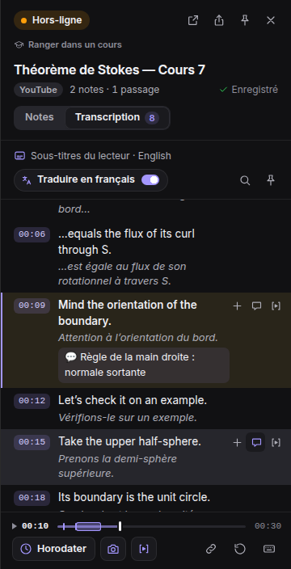
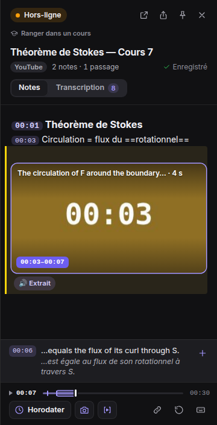
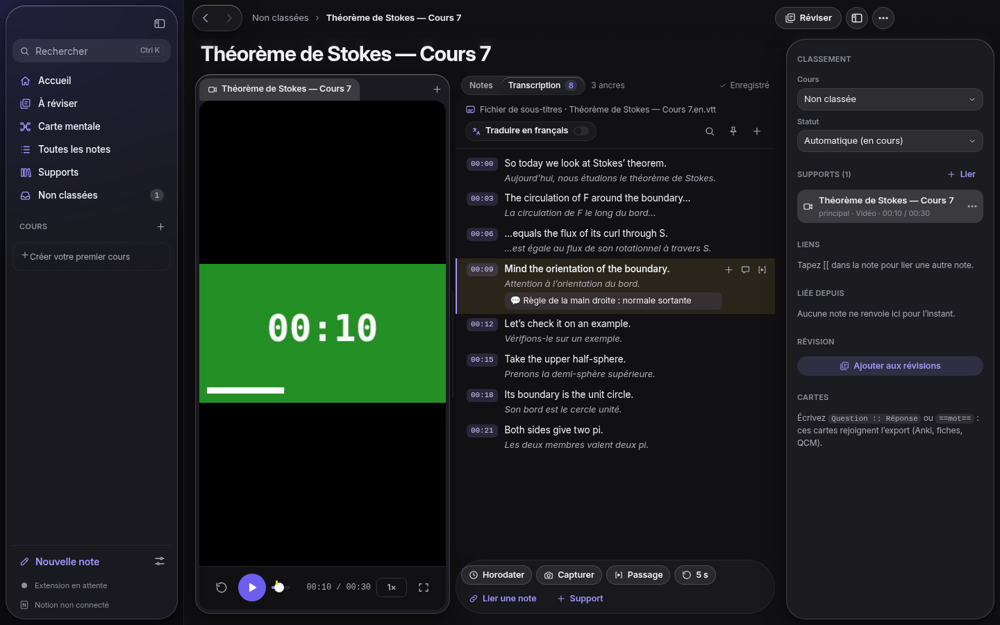

# Transcription, traduction, passages et piste audio

> **L’idée.** Pendant qu’une vidéo ou un audio de cours joue, Boo Notes recopie en arrière-plan
> ses **sous-titres horodatés** dans un document à part — la **transcription** — sans jamais
> toucher à votre prise de notes. Sur cette transcription, vous **traduisez** (en français par
> défaut) et **commentez** chaque réplique ; une phrase importante s’**épingle** dans vos notes en
> un geste. Vous pouvez **conserver le son** du cours et **extraire un passage** (par exemple
> 02:05 → 06:07) avec son image, son son, ses sous-titres et les notes prises pendant ce
> passage. À la fin de la lecture, la transcription est **épinglée** à votre note.



## 1. Ce que vous faites, ce que Boo Notes fait

| Moment | Vous | Boo Notes, en arrière-plan |
| --- | --- | --- |
| La vidéo démarre | Vous prenez vos notes comme d’habitude (`Alt + Maj + N`) | Trouve les sous-titres du cours et remplit la transcription (onglet **Transcription · 312**) |
| Pendant la lecture | Vous écrivez ; une phrase du prof vous intéresse | Le **bandeau de sous-titre** sous vos notes montre la réplique en cours et sa traduction ; `Ctrl/⌘ + Maj + K` (ou **⊕**) la cite dans la note, horodatée |
| Un passage clé commence | `Alt + I` (**Début du passage**, bouton ⧗) | Pose le point d’entrée ; enregistre image et son à partir de là (pastille **REC**) |
| Le passage se termine | `Alt + O` (**Fin du passage**) | Ajoute la **carte du passage** 02:05–06:07 à la note, avec son **extrait** enregistré |
| Plus tard | Onglet **Transcription** (`Alt + T`) : traduire, commenter, choisir deux répliques → **Créer le passage** | Garde tout dans la transcription, jamais dans vos notes personnelles |
| Fin de la vidéo (ou page quittée) | — | Épingle la transcription en bas de la note : `📄 Transcription — anglais → français · 312 répliques` |

Deux principes :

1. **Vos notes restent les vôtres.** Les sous-titres vivent dans un document à part ; ils
   n’entrent dans la note que quand vous le décidez (épingler une réplique, créer un passage) ou,
   à la fin, sous la forme d’une seule ligne-pièce jointe.
2. **Rien ne bloque la saisie.** Capture, traduction et enregistrement tournent sans voler le
   focus ; tout est réversible (supprimer la ligne épinglée, la carte du passage…).

## 2. Interface

### Panneau de l’extension

```
┌──────────────────────────────────────────┐
│ (● Connecté)  ● REC        ⧉ ⇪ 📌 ✕      │  REC : son ou passage en cours d’enregistrement
│ Maths › Analyse                          │  cours › chapitre
│ Théorème de Stokes — Cours 7             │
│ YouTube   2 notes · 1 passage  Enregistré│
│ [ Notes │ Transcription 312 ]            │  onglets (Alt+T)
├──────────────────────────────────────────┤
│ 02:05  Définition de la circulation      │  vos notes (inchangées)
│ ┌──────────────────────────────────────┐ │
│ │ Théorème de Stokes · 4 min           │ │  carte « passage » : première image,
│ │               ▶                      │ │  titre (votre première note du passage,
│ │ 02:05–06:07        ▶ Revoir le passage│ │  sinon la première réplique), durée
│ └──────────────────────────────────────┘ │
│ 🔊 Extrait                                │  l’extrait enregistré, lu dans le panneau
├──────────────────────────────────────────┤
│ 04:12 the curl of F through S…        ⊕  │  bandeau de sous-titre en direct
│       le rotationnel de F à travers S…   │  (clic : ouvre la transcription)
├──────────────────────────────────────────┤
│ ▶ 04:12 ──|──[■■■■]──|────────── 12:30   │  chronologie : [■■] passage, ▁ son conservé
│ [⏱ Horodater] [📷] [⧗]            🔗 ↺ ⌨ │  ⧗ : début / fin du passage
└──────────────────────────────────────────┘
```



**Onglet Transcription** (le « fichier en back-office »), qui suit la lecture comme un karaoké :

- **Clic** sur une heure : la vidéo y saute. **Survol** d’une réplique : ⊕ l’épingler dans la
  note (avec sa traduction), 文A la traduire à la main, 💬 la commenter, ⧗ début / fin d’un
  passage (ou **Maj + clic** sur une seconde heure) → barre **Créer le passage 02:05–06:07 ·
  18 répliques · 3 notes**, avec ou sans **Enregistrer l’extrait** (la lecture rejoue le passage
  et l’enregistre ; vous continuez d’écrire).
- **Suivre la lecture** : la réplique en cours reste visible ; si vous faites défiler, le suivi se
  met en pause (**↓ Revenir à 04:12**).
- **Traduire en français** (interrupteur) : traduction **sur l’appareil** (Chrome 138 et plus,
  aucun envoi à un service tiers), réplique par réplique à mesure qu’elles arrivent, en commençant
  par le moment regardé ; la langue des sous-titres est détectée si besoin. Chaque traduction reste
  modifiable (clic dessus). Sans traduction automatique, 文A traduit une réplique à la main.
- **Recherche** (🔍) dans le texte, les traductions et les commentaires ; **📌** épingle la
  transcription à la note tout de suite.
- **Capture en direct** : la part de la vidéo regardée avec les sous-titres affichés
  (« 38 % capturé »).

### Application Desktop

La note d’une vidéo ou d’un audio a les mêmes onglets **Notes │ Transcription** (même vue), le
même bouton **Passage** (`Alt + I` / `Alt + O`), le même enregistrement des extraits et la même
lecture d’un intervalle. Une vidéo importée avec ses sous-titres à côté (`cours.mp4` +
`cours.vtt`, `cours.en.srt`…) a sa transcription d’office ; **＋ Ajouter des sous-titres**
importe un `.vtt` / `.srt` (les traductions et commentaires suivent le moment dont ils parlaient).
La transcription d’une note du navigateur s’y **lit** (les annotations se font dans l’extension).



## 3. D’où viennent les sous-titres

Par ordre de préférence, sans configuration :

| Source | Plateformes | Couverture |
| --- | --- | --- |
| **Pistes de sous-titres du lecteur** (`video.textTracks`, WebVTT) | Coursera, lecteurs video.js / Plyr / JW, la plupart des plateformes d’école, vidéos Notion | Toute la vidéo, dès le début |
| **Liste de sous-titres de la plateforme** | YouTube (sous-titres manuels, sinon automatiques de la langue parlée) | Toute la vidéo |
| **Capture en direct** des sous-titres affichés | YouTube, Udemy, video.js, Plyr, JW, Shaka, MediaElement… | Ce qui est joué sous-titres affichés (« 38 % capturé ») |
| **Fichier** `.vtt` / `.srt` | Application : fichier voisin de la vidéo, ou **＋ Ajouter des sous-titres** | Tout le fichier |

Une meilleure source remplace la précédente en gardant vos traductions et commentaires ; une
capture en direct n’écrase jamais un fichier de sous-titres. Rien n’est gardé pour une vidéo
**sans note** : la transcription n’est enregistrée qu’une fois la note créée ou le panneau ouvert.

Un audio sans sous-titres (podcast, enregistrement d’amphi) n’a pas de transcription ; le son
conservé garde la trace du cours, et une reconnaissance vocale locale pourra s’y brancher (la
transcription est une source interchangeable).

## 4. Son du cours et extraits

- **Conserver l’audio du cours** (options de l’extension) : le son des médias notés est
  enregistré pendant la lecture, par segments (une pause, un saut ou 10 minutes = un nouveau
  segment), en Opus 48 kb/s (≈ 20 Mo par heure). La chronologie montre les parties conservées ;
  dans la transcription, 🔊 réécoute une réplique. Les segments rejoignent le dossier de notes de
  l’application (`media/`).
- **Extrait d’un passage** : image et son (vidéo WebM) ou son seul (audio).
  - *En direct* : entre **Début** et **Fin du passage**, pendant que vous regardez (l’enregistrement
    suit la lecture : rien n’est enregistré pendant une pause).
  - *Après coup* : depuis la transcription, **Enregistrer l’extrait** rejoue l’intervalle et
    l’enregistre (la durée du passage).
- Les extraits se lisent dans le panneau (🔊 **Extrait**), dans l’application, et partent dans
  l’export.
- **Revoir un passage** : clic sur sa carte, ou sur n’importe quel intervalle `[02:05–06:07]`
  écrit dans la note — la lecture s’arrête à la fin.

> Les lecteurs protégés (DRM : certains cours Udemy, Netflix…) interdisent d’enregistrer leur
> image et leur son : la carte du passage est alors dessinée, et les sous-titres et les notes
> fonctionnent quand même. Usage personnel d’étude : respectez les conditions de la plateforme.

## 5. Formats

**Dans la note** (Markdown, lisible partout) :

```markdown
[02:05] Définition de la circulation
> [04:12] « the curl of F through S » — *le rotationnel de F à travers S*
[02:05–06:07]  [Extrait](media/youtube-abc-passage-02-05-x7q.webm)

📄 [Transcription — anglais → français · 312 répliques](transcripts/youtube-abc.md)
```

- `[02:05–06:07]` (tiret court ou trait d’union) est un **intervalle** : clic = revoir le passage.
- La ligne `📄 [Transcription…](transcripts/…)` est la pièce jointe épinglée ; un clic ouvre
  l’onglet Transcription.

**La transcription** : `transcripts/<note>.json` (langue, source, et pour chaque réplique `start`,
`end`, `text`, `tr` — la traduction —, `note` — votre commentaire), et pour les humains et les
lecteurs `transcripts/<note>.md`, `.vtt` et `.fr.vtt` (la traduction).

**Dans Notion** : chaque passage est une image légendée « Passage 02:05–06:07 · titre » ; la
transcription devient une section **Transcription** en fin de page (heure liée à l’instant de la
vidéo, réplique, traduction en italique, 💬 commentaire).

**À l’export** : fiches de révision (chaque passage avec les notes prises et les répliques dites
pendant lui), Markdown (`transcripts/`, `media/`), JSON (`passages` avec `notes` et `said`,
`transcript` complet) pour générer des QCM.

## 6. Raccourcis

| Action | Raccourci |
| --- | --- |
| Épingler la réplique en cours dans la note | `Ctrl/⌘ + Maj + K` (panneau, application) |
| Début / fin du passage | `Alt + I` / `Alt + O` (page vidéo, panneau, application ; modifiables dans `chrome://extensions/shortcuts`) |
| Basculer Notes / Transcription | `Alt + T` (panneau, application) |
| Fermer le lecteur d’extrait | `Échap` |

## 7. Réglages (options de l’extension)

| Réglage | Par défaut |
| --- | --- |
| Transcrire les sous-titres en arrière-plan | activé |
| Traduire en français | désactivé (l’interrupteur de l’onglet le mémorise) |
| Enregistrer l’extrait des passages | activé |
| Conserver l’audio du cours | désactivé |

## 8. Limites connues

- Les sous-titres d’un **lecteur intégré dans une iframe d’un autre site** (Vimeo, Kaltura…) ne
  sont recopiés que s’ils s’affichent dans la page elle-même ; son horloge, elle, est suivie.
- La liste de sous-titres de YouTube peut être refusée (jeton de lecture) : la capture en direct
  prend alors le relais — activez les sous-titres (CC).
- La traduction automatique demande Chrome 138+ (modèle téléchargé une fois sur l’appareil) ;
  l’application Desktop propose la traduction à la main.

## 9. Pour les développeurs

| Élément | Fichier |
| --- | --- |
| Modèle (répliques, VTT / SRT / YouTube json3, capture en direct, passages, lignes de note) | `src/shared/transcript.ts` |
| Stockage de l’extension (fusion des sources, traductions et commentaires) | `src/shared/transcript-store.ts` |
| Extraits et son conservé (IndexedDB) | `src/shared/media-db.ts` |
| Collecte dans la page | `src/content/subtitles.ts` |
| Enregistrement (captureStream + MediaRecorder), carte d’un passage | `src/content/recorder.ts` |
| Vue Transcription (panneau et application) | `src/panel/transcript-view.ts`, `src/panel/transcript.css` |
| Traduction sur l’appareil | `src/panel/translator.ts` |
| Application : dossier de notes, sous-titres voisins, extraits | `desktop/src/core/library.ts` |
| Application : vue | `desktop/src/renderer/islands/TranscriptPanel.tsx`, `desktop/src/renderer/views/NoteView.tsx` |
| Protocole (`transcript.put`, `media.chunk`, `media.put`) | [PROTOCOL.md](PROTOCOL.md) |
